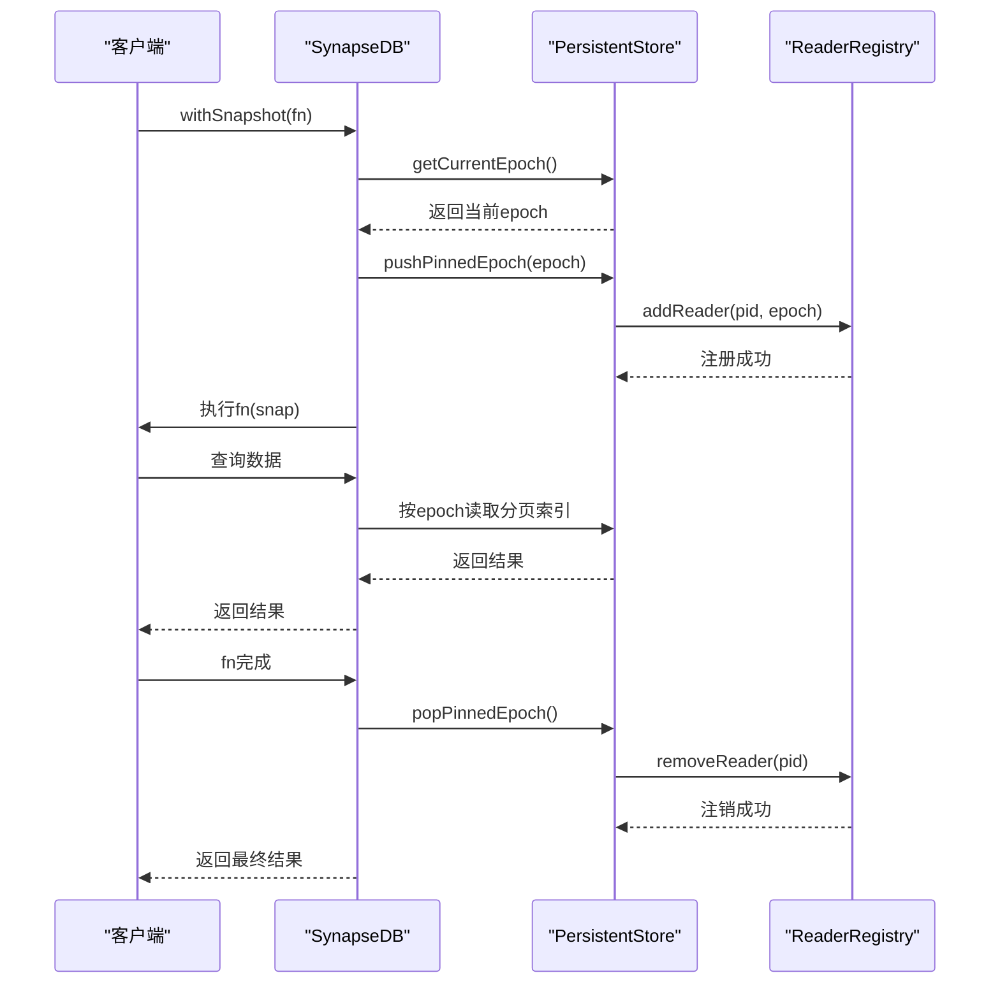

# 快照隔离机制

<cite>
**本文档中引用的文件**
- [query_snapshot_isolation.test.ts](file://tests/system/query_snapshot_isolation.test.ts)
- [synapseDb.ts](file://src/synapseDb.ts)
- [persistentStore.ts](file://src/storage/persistentStore.ts)
- [readerRegistry.ts](file://src/storage/readerRegistry.ts)
- [pagedIndex.ts](file://src/storage/pagedIndex.ts)
- [wal.ts](file://src/storage/wal.ts)
- [autoCompact.ts](file://src/maintenance/autoCompact.ts)
- [gc.ts](file://src/maintenance/gc.ts)
- [compaction.ts](file://src/maintenance/compaction.ts)
</cite>

## 目录
1. [简介](#简介)
2. [基于WAL的MVCC模型与快照隔离](#基于wal的mvcc模型与快照隔离)
3. [读版本号（read version）的确定机制](#读版本号read-version的确定机制)
4. [withSnapshot API 的隔离行为分析](#withsnapshot-api-的隔离行为分析)
5. [测试用例验证：事务可见性规则](#测试用例验证事务可见性规则)
6. [长生命周期读事务的影响与垃圾回收策略](#长生命周期读事务的影响与垃圾回收策略)
7. [结论](#结论)

## 简介
SynapseDB 实现了一种基于写前日志（Write-Ahead Logging, WAL）的多版本并发控制（MVCC）模型，以支持高效的快照隔离（Snapshot Isolation）。该机制允许长时间运行的只读查询在不阻塞写操作的前提下，看到一致的数据视图。通过 `withSnapshot` API，用户可以启动一个隔离的读取上下文，确保在整个查询过程中数据状态的一致性。

本文档详细解释了该快照隔离机制的实现原理，包括读版本号的获取、只读查询与写事务的隔离行为，并结合系统测试用例进行验证，最后讨论长读事务对存储空间的影响及自动垃圾回收的触发条件。

## 基于WAL的MVCC模型与快照隔离
SynapseDB 使用 WAL 来保证数据的持久性和一致性。所有写操作首先被追加到 WAL 文件中，然后才应用到内存和分页索引中。这种设计为 MVCC 提供了基础：每个写事务在提交时会生成一个新的“epoch”（时代），代表数据库状态的一个新版本。

快照隔离的核心思想是：当一个只读事务开始时，它会捕获当前的 epoch 作为其读版本号。在此之后，无论其他写事务如何修改数据，该只读事务始终只能看到在它开始之前已经提交的数据版本。这确保了事务内部读取的一致性，避免了脏读、不可重复读等问题。

**Section sources**
- [wal.ts](file://src/storage/wal.ts#L32-L61)
- [persistentStore.ts](file://src/storage/persistentStore.ts#L99-L238)

## 读版本号（read version）的确定机制
读版本号实际上就是事务开始时所处的数据库 epoch。这个值由 `PersistentStore` 维护，并通过 `getCurrentEpoch()` 方法获取。

当调用 `withSnapshot` 方法时，系统会立即调用底层存储的 `getCurrentEpoch()` 来获取当前的 epoch 值。这个值随后会被“钉住”（pinned），以防止在该快照存在期间被垃圾回收。具体流程如下：

1. 调用 `SynapseDB.withSnapshot()`。
2. 内部调用 `PersistentStore.getCurrentEpoch()` 获取当前 epoch。
3. 将该 epoch 推入 `pinnedEpochStack` 并增加快照引用计数。
4. 如果这是第一个快照，则向读者注册表（reader registry）注册当前进程，以通知维护任务有活跃的读取者。
5. 执行用户提供的异步函数，在此期间所有读取操作都基于该固定的 epoch。
6. 函数执行完毕后，从栈中弹出 epoch，减少引用计数。如果引用计数归零，则注销读者。

这种方式确保了即使在长时间查询过程中发生了多次写入和 compaction，查询所看到的数据视图仍然是开始时刻的一致快照。



**Diagram sources**
- [synapseDb.ts](file://src/synapseDb.ts#L477-L491)
- [persistentStore.ts](file://src/storage/persistentStore.ts#L1355-L1378)
- [readerRegistry.ts](file://src/storage/readerRegistry.ts#L55-L66)

## withSnapshot API 的隔离行为分析
`withSnapshot` API 是实现快照隔离的关键接口。它接受一个异步函数作为参数，并为其提供一个具有固定读视图的数据库实例。

### 只读查询与写事务的隔离
通过 `withSnapshot` 启动的查询完全独立于后续的写入操作。测试用例 `快照期间新写入不影响当前查询` 明确验证了这一点：在一个长查询执行中途，外部事务添加了新的事实（facts），但快照内的查询结果仍然只包含查询开始前已存在的数据。而查询结束后，直接使用数据库实例进行的查询则能看到所有新数据。

此外，`withSnapshot` 还能抵御后台维护任务（如 compaction 和 GC）的影响。由于快照会阻止相关 epoch 的页面被回收，因此即使在查询期间发生了增量合并或垃圾回收，快照内的数据链式遍历结果依然完整且正确。

**Section sources**
- [synapseDb.ts](file://src/synapseDb.ts#L477-L491)
- [query_snapshot_isolation.test.ts](file://tests/system/query_snapshot_isolation.test.ts#L100-L130)

## 测试用例验证：事务可见性规则
`query_snapshot_isolation.test.ts` 中的多个测试用例共同验证了快照隔离的可见性规则。

### 长查询与并发 compaction
`长查询期间 epoch 固定，后台 compaction 不影响链式结果` 测试创建了一个长延时的链式查询，并在此期间启动了自动增量合并。测试结果表明，尽管 manifest 的 epoch 可能因其他操作而推进，但由于快照已将初始 epoch 钉住，链式查询的结果仍然完整无缺。

### 并发 GC 对查询的影响
`链式查询期间独立 GC 操作不影响结果` 测试展示了在查询中途执行垃圾回收的情况。GC 任务通过检查 `respectReaders` 选项来查询活跃的读者列表。由于 `withSnapshot` 已将当前进程注册为读者，GC 会跳过清理可能被快照引用的页面，从而保证查询结果的完整性。

### 多重嵌套查询与并发维护
`多重嵌套链式查询与增量压缩并发` 测试模拟了复杂的查询场景。在深度嵌套的链式查询执行过程中，系统并发地执行了多次增量压缩。测试验证了最终查询结果的准确性，证明了快照隔离机制能够有效处理高并发下的复杂工作负载。

这些测试共同证实了 SynapseDB 的 MVCC 模型能够严格遵守快照隔离语义，确保读事务的可重复性和一致性。

**Section sources**
- [query_snapshot_isolation.test.ts](file://tests/system/query_snapshot_isolation.test.ts#L30-L285)

## 长生命周期读事务的影响与垃圾回收策略
长生命周期的读事务虽然提供了强大的一致性保证，但也带来了存储空间管理的挑战。被快照钉住的旧 epoch 所关联的页面无法被垃圾回收，可能导致存储膨胀。

### 存储空间影响
当一个长读事务存在时，所有在其开始之后被覆盖或删除的数据页面都不能被释放。例如，如果一个事务在 epoch N 开始，那么所有属于 epoch N 或更早的页面，只要没有被更高层的快照保护，理论上都可以被回收。但一旦有快照存在，这些页面就必须保留，直到该快照结束。

### 自动垃圾回收策略的触发条件
SynapseDB 的垃圾回收（GC）策略由 `garbageCollectPages` 函数实现，并受到 `respectReaders` 选项的控制。

1. **检查活跃读者**：GC 在开始前会调用 `getActiveReaders()` 读取 `.pages/readers/` 目录下的所有读者文件。
2. **判断是否跳过**：如果发现任何活跃的读者（即其进程 ID 仍存在且文件未过期），并且 `respectReaders` 为 true，则 GC 会立即跳过并返回 `{ skipped: true, reason: 'active_readers' }`。
3. **执行清理**：如果没有活跃读者，GC 将对每个索引顺序的页面文件进行“整理”（defragmentation），移除孤儿页面，并更新 manifest 的 epoch。
4. **自动触发**：`autoCompact` 函数在完成 compaction 后，可以选择性地调用 `garbageCollectPages` 进行自动 GC，前提是 `autoGC` 选项为 true 且没有活跃读者。

这种设计平衡了存储效率和数据一致性：它允许在安全的情况下回收空间，同时尊重正在进行的长读事务，避免了因过早回收而导致的查询失败。

```mermaid
flowchart TD
    Start([开始垃圾回收]) --> CheckRespect["检查 respectReaders 选项"]
    CheckRespect -->|true| GetReaders["读取 readers 目录"]
    GetReaders --> HasActive{"存在