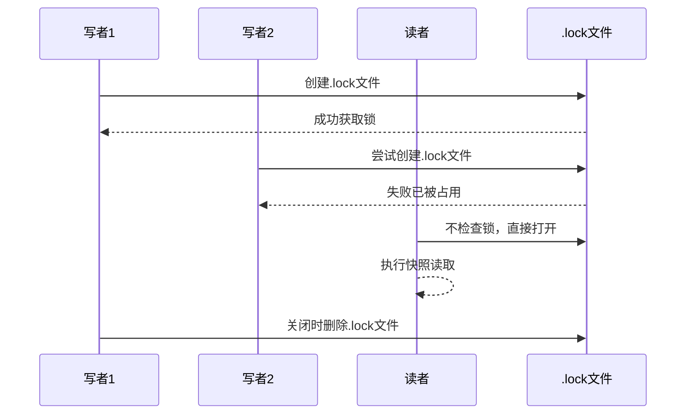
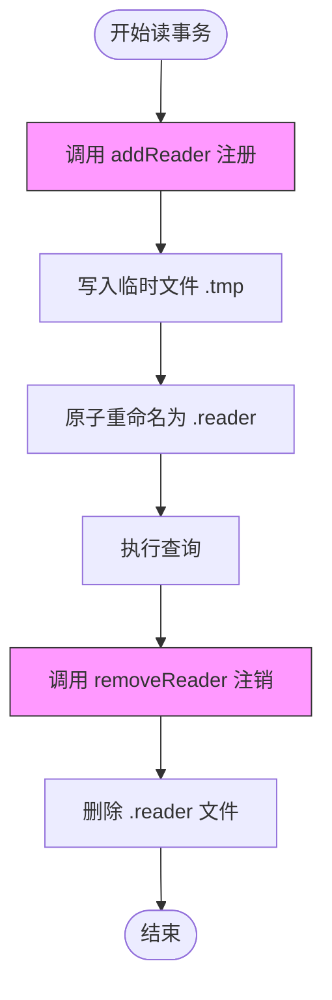
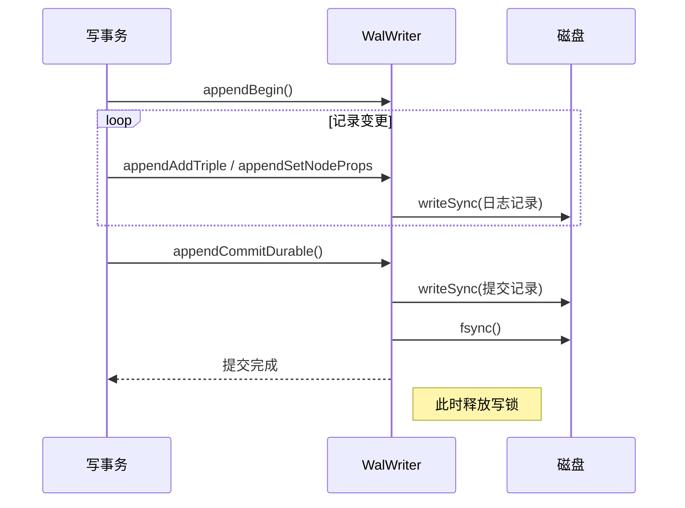

# 并发控制

<cite>
**本文档引用的文件**
- [lock.ts](file://src/utils/lock.ts)
- [readerRegistry.ts](file://src/storage/readerRegistry.ts)
- [wal.ts](file://src/storage/wal.ts)
- [synapseDb.ts](file://src/synapseDb.ts)
</cite>

## 目录
1. [引言](#引言)
2. [单写多读锁机制](#单写多读锁机制)
3. [活跃读事务跟踪与垃圾回收](#活跃读事务跟踪与垃圾回收)
4. [WAL日志写入与写锁优化](#wal日志写入与写锁优化)
5. [避免死锁与减少锁争用的编程模式](#避免死锁与减少锁争用的编程模式)
6. [异常恢复能力测试](#异常恢复能力测试)
7. [结论](#结论)

## 引言
SynapseDB 是一个支持高并发读写的图数据库系统，其核心设计目标之一是在保证数据一致性的前提下实现高效的并发访问。为达成此目标，系统采用单写多读锁（SingleWriterLock）机制协调写操作与快照读取之间的资源竞争，并通过 readerRegistry 跟踪活跃读事务以支持安全的垃圾回收和页面合并操作。同时，结合 WAL（Write-Ahead Logging）机制确保事务持久性与崩溃恢复能力。

本文档将深入分析 SynapseDB 在高并发场景下的同步机制与锁管理策略，重点阐述 `lock.ts` 中的进程级写锁、`readerRegistry.ts` 对读事务的生命周期管理以及 `wal.ts` 中的日志写入流程如何协同工作，防止写饥饿问题并保障系统的稳定性与性能。

**Section sources**
- [synapseDb.ts](file://src/synapseDb.ts#L96-L99)

## 单写多读锁机制
SynapseDB 通过文件系统级别的互斥锁实现单写者保护机制，确保同一时间只有一个写事务可以修改数据库状态，从而避免多个写者并发导致的数据损坏。该机制由 `src/utils/lock.ts` 文件中的 `acquireLock` 函数实现。

当启用锁功能时（`enableLock: true`），数据库在打开过程中会尝试创建一个 `.lock` 文件。若该文件已存在且被其他进程占用，则新写者将被拒绝访问，从而强制执行单写语义。这一机制有效防止了多个写实例同时修改同一数据库文件的风险。

值得注意的是，读操作不受此锁限制。多个无锁读者（`enableLock: false`）可以在写者运行期间正常打开数据库并执行查询，这得益于 MVCC（多版本并发控制）机制提供的快照隔离能力。

测试用例验证了以下行为：
- 启用锁后，第二个写者尝试打开相同路径会被拒绝。
- 第一个写者关闭后，锁文件自动清理，后续写者可成功获取锁。
- 读者即使不启用锁也能与写者共存，体现了读写分离的设计原则。

**Diagram sources**
- [lock.ts](file://src/utils/lock.ts)
- [concurrency_single_writer_guard.test.ts](file://tests/system/concurrency_single_writer_guard.test.ts)

**Section sources**
- [lock.ts](file://src/utils/lock.ts)
- [concurrency_single_writer_guard.test.ts](file://tests/system/concurrency_single_writer_guard.test.ts)

## 活跃读事务跟踪与垃圾回收
为了支持长时间运行的读事务并允许后台进行垃圾回收（GC）和页面合并（Compaction），SynapseDB 使用 `readerRegistry` 机制来跟踪所有活跃的读事务。

`src/storage/readerRegistry.ts` 提供了一套基于文件系统的注册表实现。每个读事务在启动时会向 `readers/` 目录下写入一个独立的 `.reader` 文件，文件名格式为 `{pid}-{timestamp}.reader`，内容包含进程 ID、epoch 编号和时间戳等信息。

关键特性包括：
- **去中心化设计**：每个进程独立管理自己的 reader 文件，避免多进程竞争单一文件。
- **原子写入**：使用临时文件 + rename 的方式确保注册过程的原子性。
- **过期清理**：设置 30 秒的过期阈值，定期清理陈旧的 reader 文件，防止无限增长。
- **epoch 跟踪**：通过 `getActiveEpochs` 和 `isEpochInUse` 接口判断特定版本是否仍在被读取。

该机制使得 GC 和 Compaction 操作能够安全地跳过仍被活跃读事务引用的数据页或段，只有当某个 epoch 不再被任何 reader 使用时，相关资源才可被回收。

**Diagram sources**
- [readerRegistry.ts](file://src/storage/readerRegistry.ts#L55-L66)
- [readerRegistry.ts](file://src/storage/readerRegistry.ts#L72-L93)

**Section sources**
- [readerRegistry.ts](file://src/storage/readerRegistry.ts)
- [autoCompact.test.ts](file://tests/integration/maintenance/auto_compact_respect_readers.test.ts)
- [gc.test.ts](file://tests/integration/maintenance/gc_respect_readers.test.ts)

## WAL日志写入与写锁优化
WAL（预写式日志）是 SynapseDB 实现事务持久性和崩溃恢复的核心组件。位于 `src/storage/wal.ts` 的 `WalWriter` 类负责将所有变更记录按顺序追加到 `.wal` 文件中。

### 写锁临界区范围
写锁的持有时间被严格限制在 WAL 日志的写入阶段，具体包括：
1. 调用 `appendBegin()` 记录事务开始
2. 多次调用 `appendAddTriple`、`appendSetNodeProps` 等方法记录变更
3. 调用 `appendCommit()` 或 `appendAbort()` 标记事务结束

其中最关键的是 `appendCommitDurable()` 方法，它不仅写入提交记录，还调用 `fsync()` 确保日志持久化到磁盘，之后才释放写锁。这种设计最小化了锁的持有时间，仅在必须保证原子性和持久性时才持锁。

### 性能优化措施
- **同步写入（writeSync）**：使用 `fssync.writeSync` 避免跨进程读取竞态条件。
- **批量提交**：支持嵌套事务（BEGIN/COMMIT 堆栈），内层提交可提前提升变更可见性。
- **幂等处理**：通过 `txId` 去重机制防止重复应用已提交事务。

**Diagram sources**
- [wal.ts](file://src/storage/wal.ts#L26-L140)
- [wal.ts](file://src/storage/wal.ts#L105-L108)

**Section sources**
- [wal.ts](file://src/storage/wal.ts)
- [wal.test.ts](file://tests/integration/storage/wal_commit_durable.test.ts)

## 避免死锁与减少锁争用的编程模式
为提升系统在高并发环境下的吞吐量并降低锁冲突概率，SynapseDB 推荐以下编程实践：

### 短事务设计
尽可能缩短事务生命周期，特别是在写密集型场景中。长事务会延长写锁持有时间，增加与其他写者的冲突概率。建议将大事务拆分为多个小事务分批提交。

### 异步提交
利用 `appendCommitDurable()` 的异步特性，在不影响业务逻辑的前提下将 `fsync` 操作放入后台线程执行，减少主线程阻塞时间。

### 读写分离配置
生产环境中应明确区分写者与读者角色：
- 写者启用锁（`enableLock: true`）
- 读者禁用锁（`enableLock: false`），并通过快照读取保证一致性

### 进程崩溃恢复
系统具备从崩溃中恢复的能力。若前一进程未正常关闭导致 `.lock` 文件残留，新实例在检测到原进程不存在后仍可接管数据库并继续运行，确保服务可用性。

## 异常恢复能力测试
通过一系列集成测试验证系统在异常场景下的健壮性：

- `wal_tail_truncation.test.ts`：模拟 WAL 尾部截断，验证重放逻辑能正确识别完整记录边界。
- `crash_injection.test.ts`：注入故障模拟进程崩溃，测试重启后数据一致性。
- `wal_nested_bug_reproduce.test.ts`：验证嵌套事务的 ABORT 行为是否符合预期。
- `lockfile.test.ts`：确认锁文件在正常关闭后被清理，且崩溃后可通过心跳检测恢复。

这些测试共同证明 SynapseDB 具备强恢复能力，能够在各种异常条件下保持数据完整性。

**Section sources**
- [wal.test.ts](file://tests/integration/storage/wal_tail_truncation.test.ts)
- [crash_injection.test.ts](file://tests/system/crash_injection.test.ts)
- [lockfile.test.ts](file://tests/integration/storage/lockfile.test.ts)

## 结论
SynapseDB 通过精心设计的单写多读锁机制、基于文件系统的 readerRegistry 和高效的 WAL 日志系统，实现了高并发场景下的安全与性能平衡。写锁的精细控制减少了争用，readerRegistry 支持了非阻塞的 GC 与 Compaction，而 WAL 则保障了事务的持久性与崩溃恢复能力。

开发者应遵循短事务、异步提交和读写分离的最佳实践，以充分发挥系统潜力。未来可进一步探索乐观并发控制（OCC）或轻量级内存锁机制，进一步提升写吞吐量。