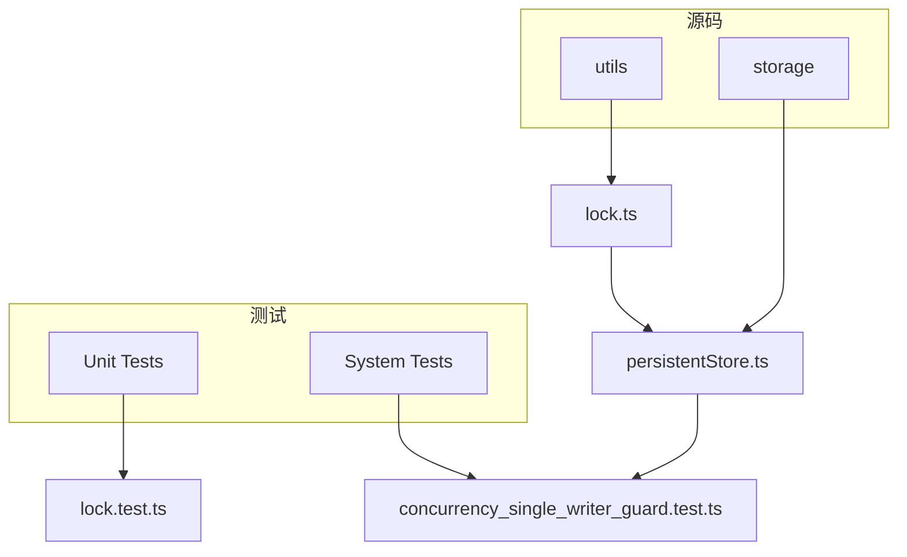
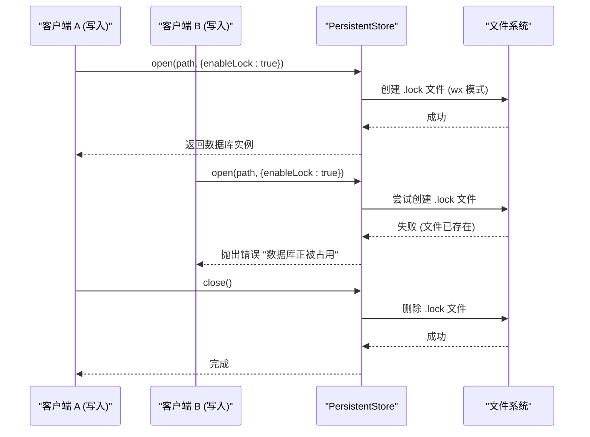
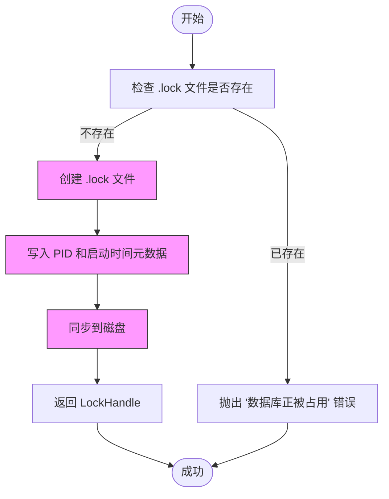
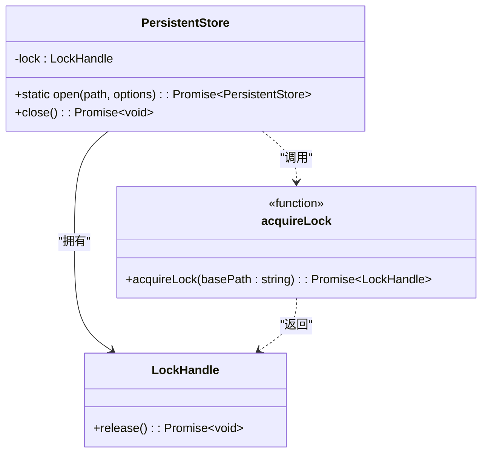

# 读写锁机制

<cite>
**本文档引用的文件**
- [lock.ts](file://src/utils/lock.ts)
- [lock.test.ts](file://tests/unit/utils/lock.test.ts)
- [persistentStore.ts](file://src/storage/persistentStore.ts)
- [synapseDb.ts](file://src/synapseDb.ts)
- [concurrency_single_writer_guard.test.ts](file://tests/system/concurrency_single_writer_guard.test.ts)
</cite>

## 目录
1. [简介](#简介)
2. [项目结构](#项目结构)
3. [核心组件](#核心组件)
4. [架构概述](#架构概述)
5. [详细组件分析](#详细组件分析)
6. [依赖关系分析](#依赖关系分析)
7. [性能考量](#性能考量)
8. [故障排除指南](#故障排除指南)
9. [结论](#结论)

## 简介
本技术文档深入解析SynapseDB中实现的单写者并发控制机制。该系统通过基于文件系统的独占锁（Single Writer Lock）确保同一数据库实例在同一时间仅允许一个写入进程，从而维护数据一致性与完整性。文档将阐述其底层实现原理、获取与释放流程、公平性策略，并结合测试用例展示在高并发场景下的行为表现。

## 项目结构
SynapseDB项目采用模块化设计，其核心功能分散于`src`目录下的多个子模块中。与并发控制直接相关的代码主要位于`src/utils/lock.ts`和`src/storage/persistentStore.ts`。前者提供了基础的文件锁原语，后者则在其之上构建了完整的单写者保护逻辑。测试用例分布在`tests/unit/utils/`和`tests/system/`目录下，分别验证单元功能和系统级并发行为。

**图表来源**
- [lock.ts](file://src/utils/lock.ts)
- [persistentStore.ts](file://src/storage/persistentStore.ts)
- [concurrency_single_writer_guard.test.ts](file://tests/system/concurrency_single_writer_guard.test.ts)

**章节来源**
- [src/utils/lock.ts](file://src/utils/lock.ts)
- [src/storage/persistentStore.ts](file://src/storage/persistentStore.ts)

## 核心组件
系统的核心并发控制由两个关键组件构成：`acquireLock`函数提供的原子性文件锁，以及`PersistentStore`类中集成的锁管理逻辑。`acquireLock`利用操作系统的文件创建原子性来实现互斥，而`PersistentStore`则负责在数据库打开和关闭时正确地获取与释放此锁，并处理各种边界情况。

**章节来源**
- [lock.ts](file://src/utils/lock.ts#L6-L41)
- [persistentStore.ts](file://src/storage/persistentStore.ts#L99-L238)

## 架构概述
SynapseDB的并发控制架构遵循“单写者多读者”（Single Writer, Multiple Readers）模式。当一个进程以写入模式打开数据库时，它会尝试获取一个排他性的文件锁。一旦成功，其他试图以写入模式打开同一数据库的进程将被阻塞或拒绝，从而保证了写操作的串行化。与此同时，允许多个只读进程同时访问数据库，实现了高效的并发读取。

**图表来源**
- [lock.ts](file://src/utils/lock.ts#L6-L41)
- [persistentStore.ts](file://src/storage/persistentStore.ts#L99-L238)

## 详细组件分析

### 单写锁实现分析
`acquireLock`函数是整个并发控制机制的基石。它通过调用Node.js的`fs.open()`方法并指定`'wx'`标志来创建一个锁文件。`'w'`表示写入模式，`'x'`标志确保了创建操作的原子性——如果文件已存在，则调用会立即失败。这种原子性是实现互斥的关键。

#### 锁获取与释放流程

**图表来源**
- [lock.ts](file://src/utils/lock.ts#L6-L41)

#### 锁句柄行为
`acquireLock`返回一个`LockHandle`对象，其包含一个`release`异步方法。该方法负责安全地关闭文件句柄并删除锁文件。为了防止进程意外终止导致锁文件残留，代码还注册了`exit`、`SIGINT`和`SIGTERM`事件监听器，在进程退出前自动调用`release`。

**章节来源**
- [lock.ts](file://src/utils/lock.ts#L6-L41)

### 并发协调行为分析
系统级测试`concurrency_single_writer_guard.test.ts`全面验证了锁机制在真实场景下的行为。测试表明，当第一个写入者持有锁时，第二个写入者的`open`调用会被明确拒绝。只有在第一个写入者正常关闭数据库后，第二个写入者才能成功获取锁并进行写入。这确保了写操作的严格串行化。

此外，测试还验证了混合模式的兼容性：一个启用锁的写入者可以与任意数量禁用锁的只读者共存。这体现了“单写者多读者”的设计原则，即写锁仅用于阻止其他写者，而不影响读取操作的并发性。

**章节来源**
- [concurrency_single_writer_guard.test.ts](file://tests/system/concurrency_single_writer_guard.test.ts)

## 依赖关系分析
`PersistentStore`类对`acquireLock`函数有直接依赖。在`PersistentStore.open`方法中，当`options.enableLock`为`true`时，会调用`acquireLock(path)`来获取锁，并将返回的`LockHandle`存储在实例的`lock`属性中。在`PersistentStore.close`方法中，会检查`this.lock`是否存在，若存在则调用其`release`方法来释放锁。这种清晰的依赖关系确保了锁的生命周期与数据库连接的生命周期完全一致。

**图表来源**
- [persistentStore.ts](file://src/storage/persistentStore.ts#L99-L238)
- [lock.ts](file://src/utils/lock.ts#L6-L41)

## 性能考量
基于文件的锁机制虽然简单可靠，但其性能受制于文件系统的I/O延迟。每次打开和关闭数据库都需要进行文件创建和删除操作，这在频繁开闭的场景下可能成为瓶颈。然而，对于典型的数据库应用，连接通常是长寿命的，因此这部分开销可以被摊薄。锁本身的争用成本极低，因为它本质上是一个快速的文件系统元数据操作。

## 故障排除指南
常见的锁相关问题包括：
- **"数据库正被占用"错误**：通常意味着另一个写入进程正在运行。应检查是否有其他程序或脚本打开了该数据库。
- **锁文件残留**：如果进程崩溃或被强制杀死，锁文件可能不会被清理。此时，用户需要手动删除`.lock`文件。系统测试中也考虑到了这种情况，模拟了进程崩溃后新实例的启动行为。

**章节来源**
- [lock.test.ts](file://tests/unit/utils/lock.test.ts)
- [concurrency_single_writer_guard.test.ts](file://tests/system/concurrency_single_writer_guard.test.ts)

## 结论
SynapseDB通过一个简洁而有效的基于文件的独占锁机制，成功实现了单写者并发控制。该设计利用了操作系统提供的原子性原语，避免了复杂的线程同步逻辑，保证了跨平台的可移植性和可靠性。结合完善的测试用例，该机制能够有效防止数据损坏，并支持高并发的读取场景，为数据库的稳定运行提供了坚实的基础。