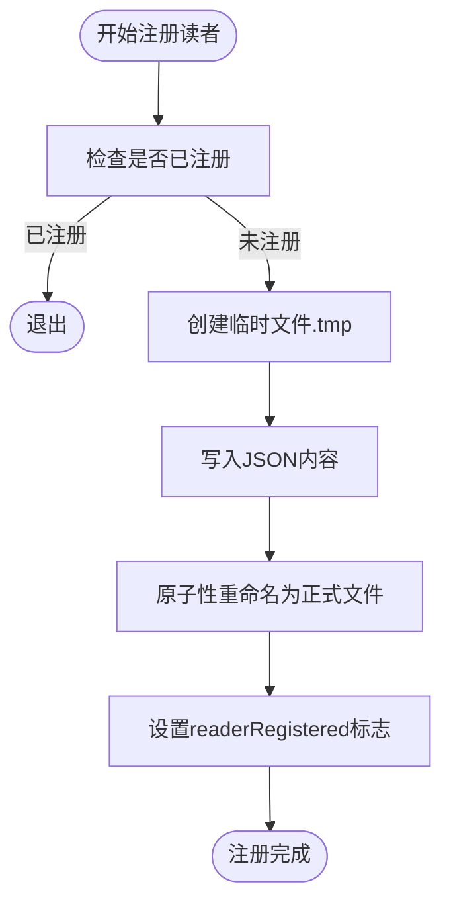
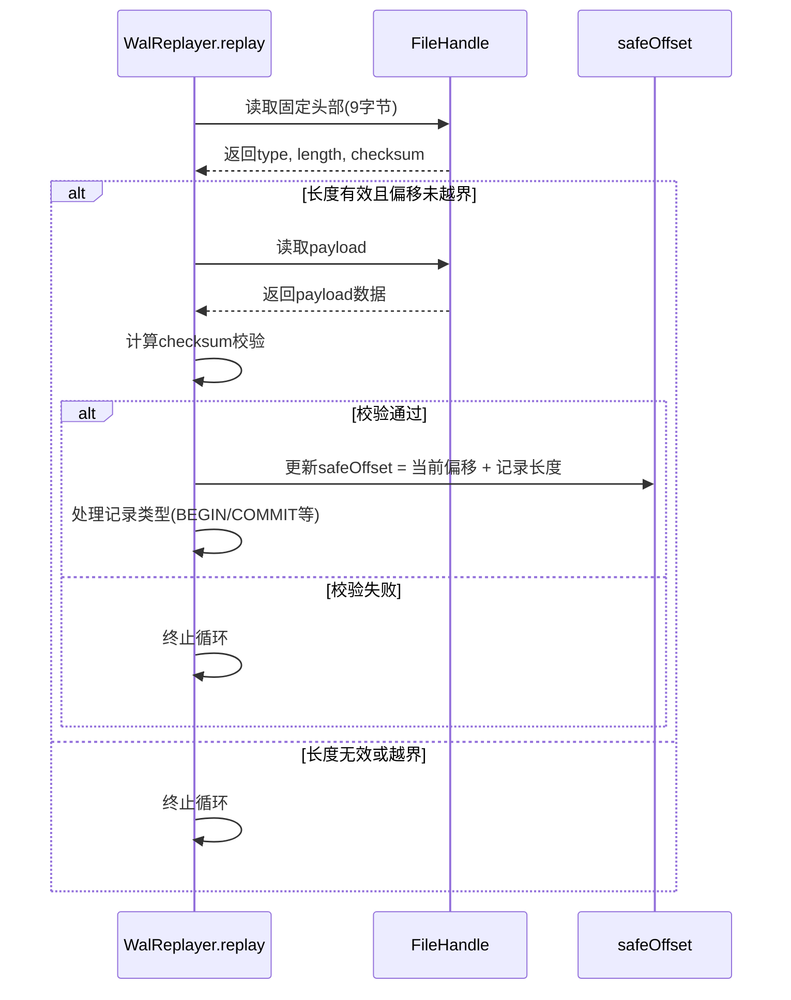
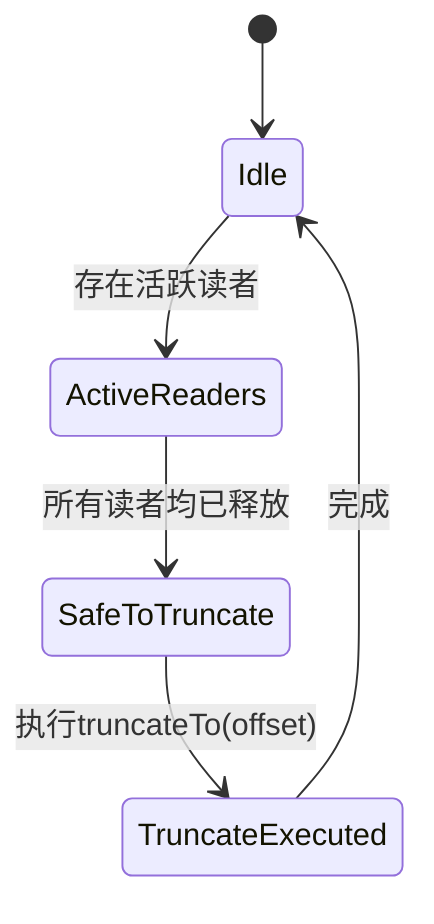
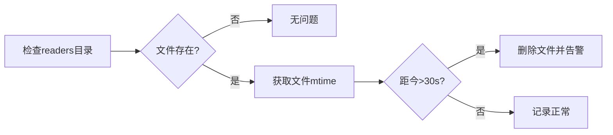

# WAL截断安全边界

<cite>
**本文档引用文件**   
- [wal.ts](file://src/storage/wal.ts)
- [readerRegistry.ts](file://src/storage/readerRegistry.ts)
- [persistentStore.ts](file://src/storage/persistentStore.ts)
- [concurrency_single_writer_guard.test.ts](file://tests/system/concurrency_single_writer_guard.test.ts)
</cite>

## 目录
1. [核心机制概述](#核心机制概述)
2. [ReaderRegistry与活跃版本号维护](#readerregistry与活跃版本号维护)
3. [truncateTo方法的安全性校验流程](#truncateto方法的安全性校验流程)
4. [offset参数有效性验证与原子性保证](#offset参数有效性验证与原子性保证)
5. [多读事务存在时的阻塞行为分析](#多读事务存在时的阻塞行为分析)
6. [长时间未释放读者句柄的诊断方案](#长时间未释放读者句柄的诊断方案)

## 核心机制概述
WAL（Write-Ahead Logging）日志截断操作是数据库管理系统中用于回收存储空间的关键机制。在SynapseDB中，`truncateTo`方法负责清理不再需要的WAL日志段，但必须确保不会影响仍在进行的读取事务。该过程通过`ReaderRegistry`组件维护的最小活跃版本号来确定可安全截断的位置，从而保障数据一致性与读写并发安全性。

**Section sources**
- [wal.ts](file://src/storage/wal.ts#L120-L123)
- [readerRegistry.ts](file://src/storage/readerRegistry.ts#L16-L19)

## ReaderRegistry与活跃版本号维护
`ReaderRegistry`采用基于文件系统的实现方式，每个进程独立管理自己的reader文件，避免了多进程竞争单一注册表的竞态条件。其核心设计借鉴LSM-Tree分层思想，通过为每个活跃读取者创建独立的`.reader`文件来记录其元信息。



**Diagram sources**
- [readerRegistry.ts](file://src/storage/readerRegistry.ts#L55-L66)
- [readerRegistry.ts](file://src/storage/readerRegistry.ts#L72-L93)

当一个读取事务启动时，系统会调用`addReader`函数，在指定目录下的`readers`子目录中创建一个形如`{pid}-{timestamp}.reader`的文件，并将包含`pid`、`epoch`和时间戳的`ReaderInfo`对象以JSON格式写入。此操作通过先写临时文件再执行`rename`的方式保证原子性，防止部分写入导致的数据损坏。

**Section sources**
- [readerRegistry.ts](file://src/storage/readerRegistry.ts#L55-L66)
- [readerRegistry.ts](file://src/storage/readerRegistry.ts#L99-L140)

## truncateTo方法的安全性校验流程
`truncateTo`方法本身不直接执行安全性校验，而是由上层逻辑在调用前完成所有必要的检查。其职责仅限于执行最终的文件截断操作：

```typescript
async truncateTo(offset: number): Promise<void> {
  await this.fd.truncate(offset);
  this.offset = offset;
}
```

真正的安全性校验发生在`WalReplayer.replay`过程中。在重放WAL日志时，系统会逐条解析记录并维护一个`safeOffset`变量，表示当前已成功处理且校验通过的最后一个完整记录的结束位置。一旦遇到不完整的记录或校验失败，循环立即终止，此时的`safeOffset`即为可安全截断的位置。



**Diagram sources**
- [wal.ts](file://src/storage/wal.ts#L145-L320)
- [wal.ts](file://src/storage/wal.ts#L209-L246)

**Section sources**
- [wal.ts](file://src/storage/wal.ts#L145-L320)
- [wal.ts](file://src/storage/wal.ts#L120-L123)

## offset参数有效性验证与原子性保证
`truncateTo`方法接收的`offset`参数来源于`WalReplayer.replay`返回的`safeOffset`值，该值经过严格的完整性校验，确保指向一个完整且有效的WAL记录末尾。文件系统的`truncate`操作本身具有原子性语义：要么整个操作成功，将文件截断至指定长度；要么失败，文件保持原状。此外，`WalWriter`内部维护的`this.offset`状态会在截断后同步更新，保证内存视图与磁盘状态一致。

**Section sources**
- [wal.ts](file://src/storage/wal.ts#L120-L123)
- [wal.ts](file://src/storage/wal.ts#L114-L118)

## 多读事务存在时的阻塞行为分析
虽然`concurrency_single_writer_guard.test.ts`主要测试单写者保护机制，但其设计原理间接反映了多读事务对写操作的影响。当多个读取事务同时存在时，它们各自持有的`epoch`会被`ReaderRegistry`跟踪。只要有任何一个读者的`epoch`小于待截断位置对应的版本号，清理操作就必须等待，否则将破坏快照隔离性。

尽管测试文件未直接模拟截断阻塞，但从`pushPinnedEpoch`和`popPinnedEpoch`的实现可以看出，系统通过引用计数(`snapshotRefCount`)管理快照生命周期。只有当所有相关快照都被释放（即`snapshotRefCount`降为0）后，对应的读者才会从注册表中移除，进而允许更高版本的WAL日志被安全清理。



**Diagram sources**
- [persistentStore.ts](file://src/storage/persistentStore.ts#L1355-L1363)
- [persistentStore.ts](file://src/storage/persistentStore.ts#L1365-L1378)

**Section sources**
- [persistentStore.ts](file://src/storage/persistentStore.ts#L1320-L1352)
- [persistentStore.ts](file://src/storage/persistentStore.ts#L1355-L1378)

## 长时间未释放读者句柄的诊断方案
为防止因应用程序异常导致读者句柄长期未释放，`ReaderRegistry`内置了过期检测机制。`getActiveReaders`函数在遍历`.reader`文件时，会检查每个文件的最后修改时间（mtime），若距今超过30秒（`staleThreshold`），则认为该文件已过期并自动清理。

诊断此类问题的方法包括：
1. **监控readers目录**：定期检查`{dbPath}.pages/readers/`目录下的文件数量和年龄。
2. **启用维护任务**：调用`cleanupStaleReaders(directory, maxAge)`手动触发清理，`maxAge`可设为较短间隔（如5秒）以加速诊断。
3. **日志审计**：在`removeReader`和`cleanupStaleReaders`中添加日志输出，记录被清理的过期文件及其PID，便于追踪源头。



**Diagram sources**
- [readerRegistry.ts](file://src/storage/readerRegistry.ts#L99-L140)
- [readerRegistry.ts](file://src/storage/readerRegistry.ts#L183-L207)

**Section sources**
- [readerRegistry.ts](file://src/storage/readerRegistry.ts#L99-L140)
- [readerRegistry.ts](file://src/storage/readerRegistry.ts#L183-L207)