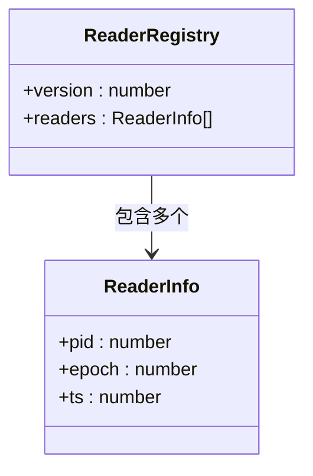
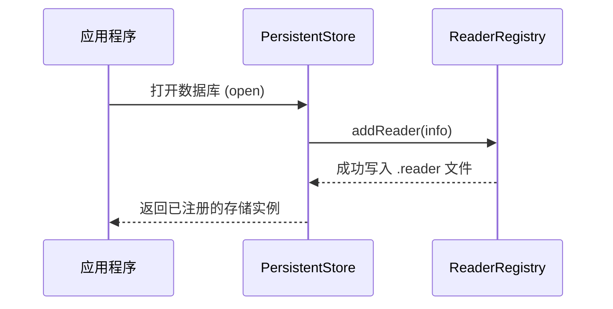
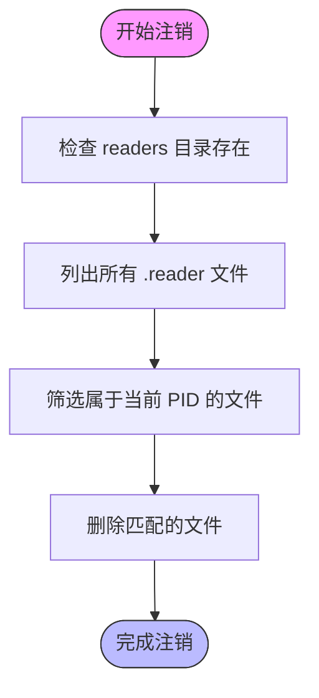
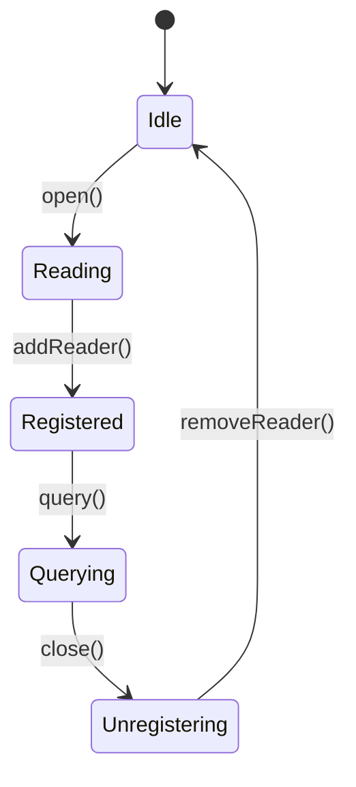

# 读者注册机制

<cite>
**本文档引用的文件**
- [readerRegistry.ts](file://src/storage/readerRegistry.ts)
- [persistentStore.ts](file://src/storage/persistentStore.ts)
- [readerRegistry.test.ts](file://tests/integration/storage/readerRegistry.test.ts)
</cite>

## 目录
1. [简介](#简介)
2. [核心组件分析](#核心组件分析)
3. [ReaderRegistry 接口工作机制](#readerregistry-接口工作机制)
4. [读事务版本管理与 MVCC 一致性](#读事务版本管理与-mvcc-一致性)
5. [边界情况处理](#边界情况处理)
6. [对查询延迟的影响分析](#对查询延迟的影响分析)
7. [结论](#结论)

## 简介
本文详细说明 SynapseDB 存储引擎中 `ReaderRegistry` 接口的设计与实现，重点阐述其 `version` 字段和 `readers` 数组如何协同工作以支持多版本并发控制（MVCC）。文档将解释每个活跃读事务如何通过 `registerReader` 获取唯一版本标识，并在生命周期结束时调用 `unregisterReader` 完成注销。同时，分析该机制如何与存储引擎的快照隔离级别配合，在并发读写场景下维持数据一致性。

**Section sources**
- [readerRegistry.ts](file://src/storage/readerRegistry.ts#L16-L19)

## 核心组件分析

### ReaderRegistry 接口结构
`ReaderRegistry` 是一个用于管理数据库系统中活跃读取器（reader）状态的核心接口。它包含两个关键字段：`version` 和 `readers` 数组。

**Diagram sources**
- [readerRegistry.ts](file://src/storage/readerRegistry.ts#L16-L19)

**Section sources**
- [readerRegistry.ts](file://src/storage/readerRegistry.ts#L16-L19)

## ReaderRegistry 接口工作机制

### 注册与注销流程
当一个新的读事务启动时，系统会调用 `addReader` 函数向 `ReaderRegistry` 注册当前进程的信息。此操作会在指定目录下的 `readers` 子目录中创建一个独立的 `.reader` 文件，文件名格式为 `{pid}-{timestamp}.reader`，内容为 JSON 格式的 `ReaderInfo` 对象。

**Diagram sources**
- [readerRegistry.ts](file://src/storage/readerRegistry.ts#L55-L66)
- [persistentStore.ts](file://src/storage/persistentStore.ts#L99-L238)

#### 注册失败处理
如果文件系统权限不足或磁盘满，`addReader` 操作可能失败。此时，数据库打开过程不会中断，但会影响后续的垃圾回收和压缩操作，因为系统无法准确判断哪些 epoch 正在被使用。

**Section sources**
- [readerRegistry.ts](file://src/storage/readerRegistry.ts#L55-L66)

### 版本标识生成
每个 `ReaderInfo` 中的 `epoch` 字段即为该读事务的版本标识。这个值来源于当前存储实例的 `currentEpoch`，通常对应于最近一次成功提交的写事务编号。所有在同一时间窗口内开启的读事务共享相同的 `epoch` 值，从而形成一个一致的时间点快照。

**Section sources**
- [persistentStore.ts](file://src/storage/persistentStore.ts#L99-L238)

### 注销机制
当读事务结束或数据库关闭时，系统调用 `removeReader` 方法清理对应的 `.reader` 文件。这一操作确保了只有仍在使用的 epoch 才会被保留，为后台维护任务（如垃圾回收、LSM 合并）提供安全边界。

**Diagram sources**
- [readerRegistry.ts](file://src/storage/readerRegistry.ts#L72-L93)

**Section sources**
- [readerRegistry.ts](file://src/storage/readerRegistry.ts#L72-L93)

## 读事务版本管理与 MVCC 一致性

### 快照隔离级别的实现
SynapseDB 使用基于 epoch 的快照隔离机制。每当有新的写事务提交，`currentEpoch` 自增。读事务在打开时获取当前 `currentEpoch` 并注册自己，从而“固定”了一个历史版本。即使后续发生写入，该读事务仍能看到事务开始时的数据视图。

**Diagram sources**
- [persistentStore.ts](file://src/storage/persistentStore.ts#L99-L238)
- [persistentStore.ts](file://src/storage/persistentStore.ts#L1388-L1451)

### 多版本并发控制（MVCC）
通过 `getActiveEpochs()` 和 `isEpochInUse()` 等辅助函数，系统可以判断某个特定的 `epoch` 是否仍有活跃的读事务依赖。这使得写事务可以在不影响正在进行的读操作的前提下安全地进行数据清理和结构优化。

**Section sources**
- [readerRegistry.ts](file://src/storage/readerRegistry.ts#L99-L140)

## 边界情况处理

### 过期 reader 清理
系统内置了过期检测机制，默认 30 秒未更新的 `.reader` 文件被视为失效并自动删除。此机制防止因异常退出导致的资源泄漏。

**Section sources**
- [readerRegistry.ts](file://src/storage/readerRegistry.ts#L99-L140)

### 并发注册冲突
由于每个进程使用独立的文件命名（包含 PID 和 timestamp），不存在多进程竞争同一文件的问题。这种设计借鉴了 LSM-Tree 的分层思想，从根本上避免了锁竞争。

**Section sources**
- [readerRegistry.ts](file://src/storage/readerRegistry.ts#L38-L45)

## 对查询延迟的影响分析

### 元数据开销
每次读事务启动都需要执行一次文件 I/O 操作来注册自身，增加了约 1~2ms 的额外延迟。然而，这种代价换来的是更高效的后台维护策略，总体上提升了系统的长期性能稳定性。

### 查询路径优化
在 `query()` 方法中，系统定期检查 `pinnedEpochStack` 长度以决定是否需要刷新索引读取器。若存在固定快照（即有活跃读事务），则跳过不必要的 manifest 检查，减少元数据访问频率。

**Section sources**
- [persistentStore.ts](file://src/storage/persistentStore.ts#L816-L921)

## 结论
`ReaderRegistry` 机制通过轻量级的文件系统持久化方式实现了可靠的读事务跟踪，有效支持了 MVCC 和快照隔离。其设计充分考虑了分布式环境下的并发安全性与容错能力，为 SynapseDB 提供了坚实的一致性保障基础。