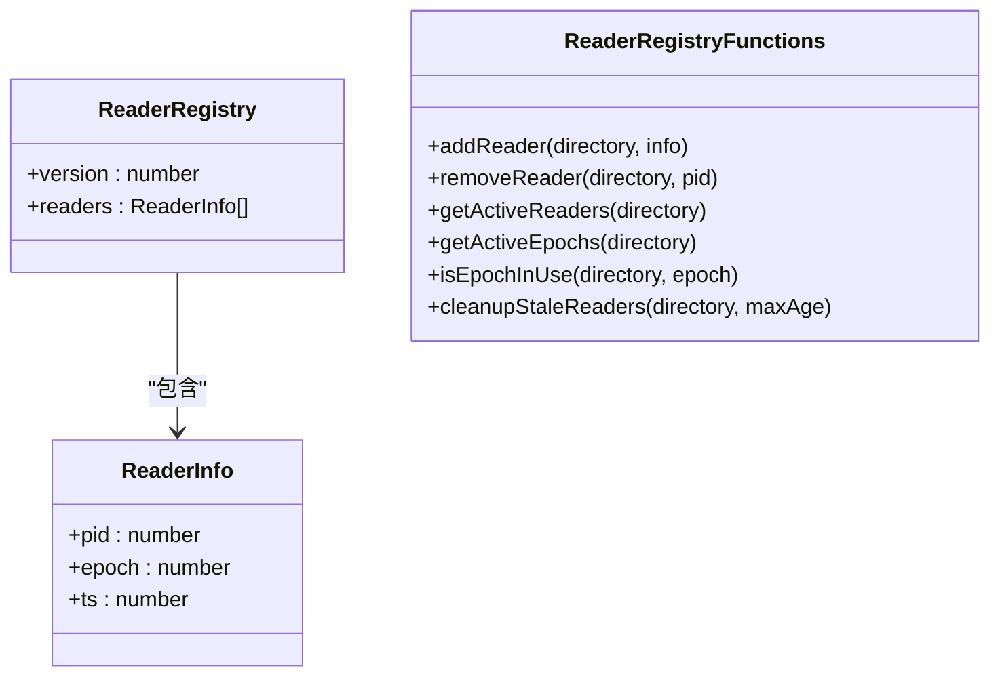
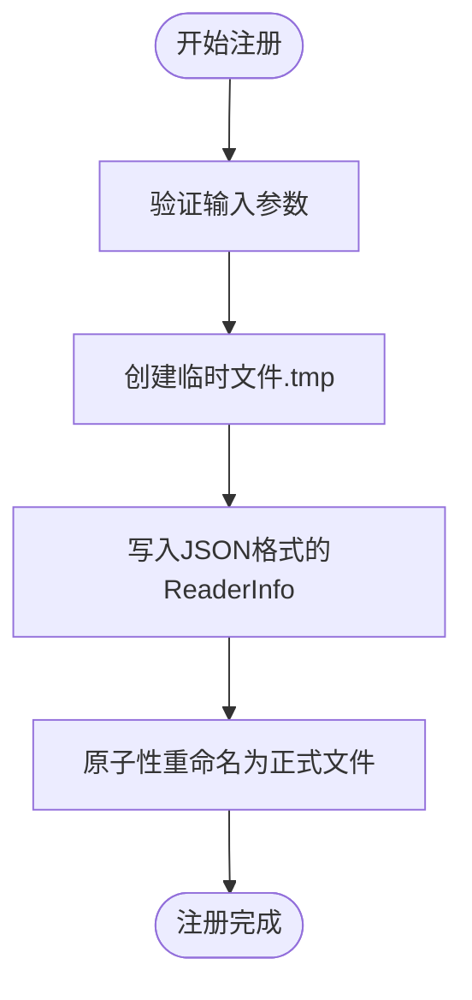
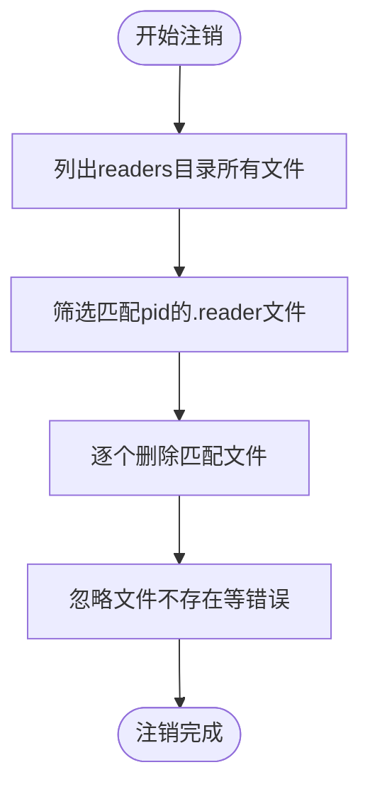
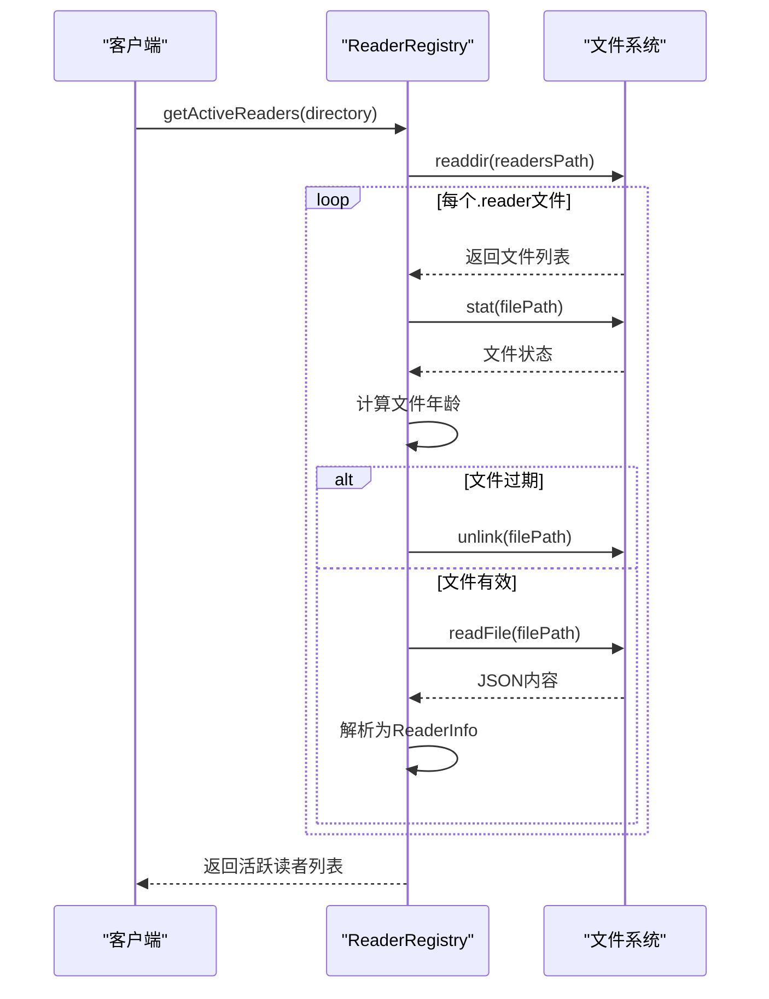
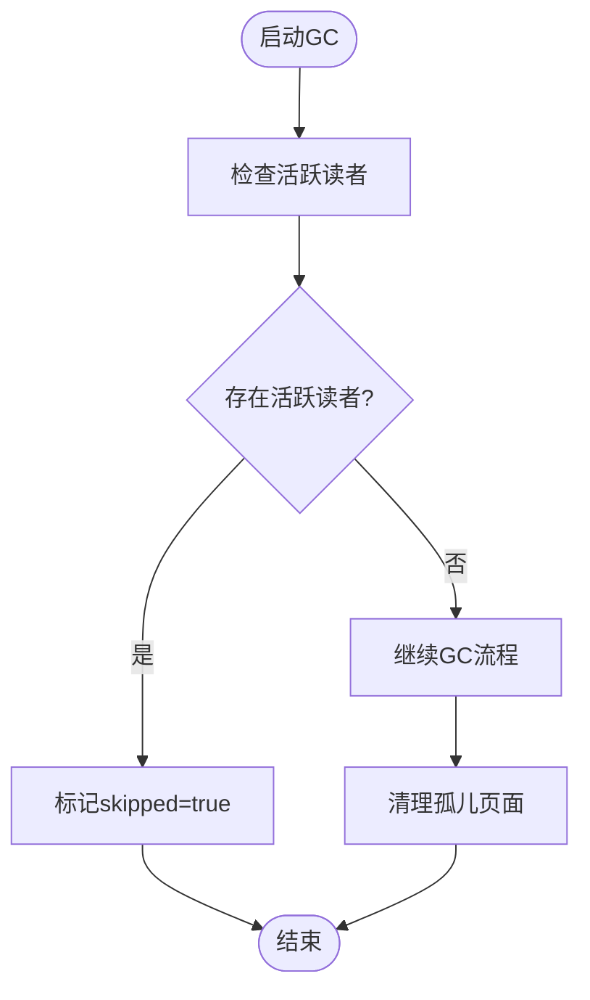
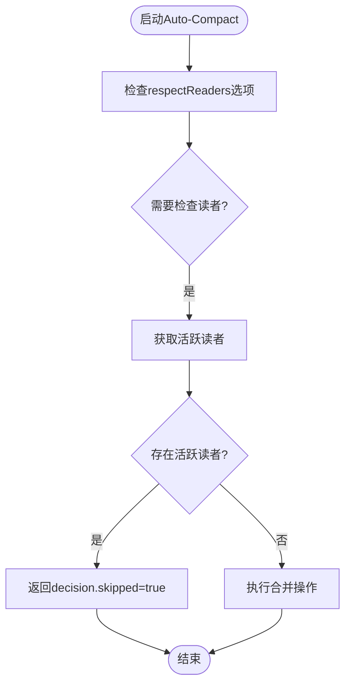
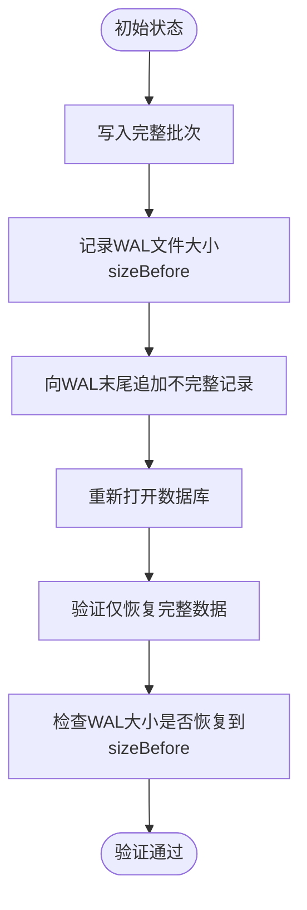
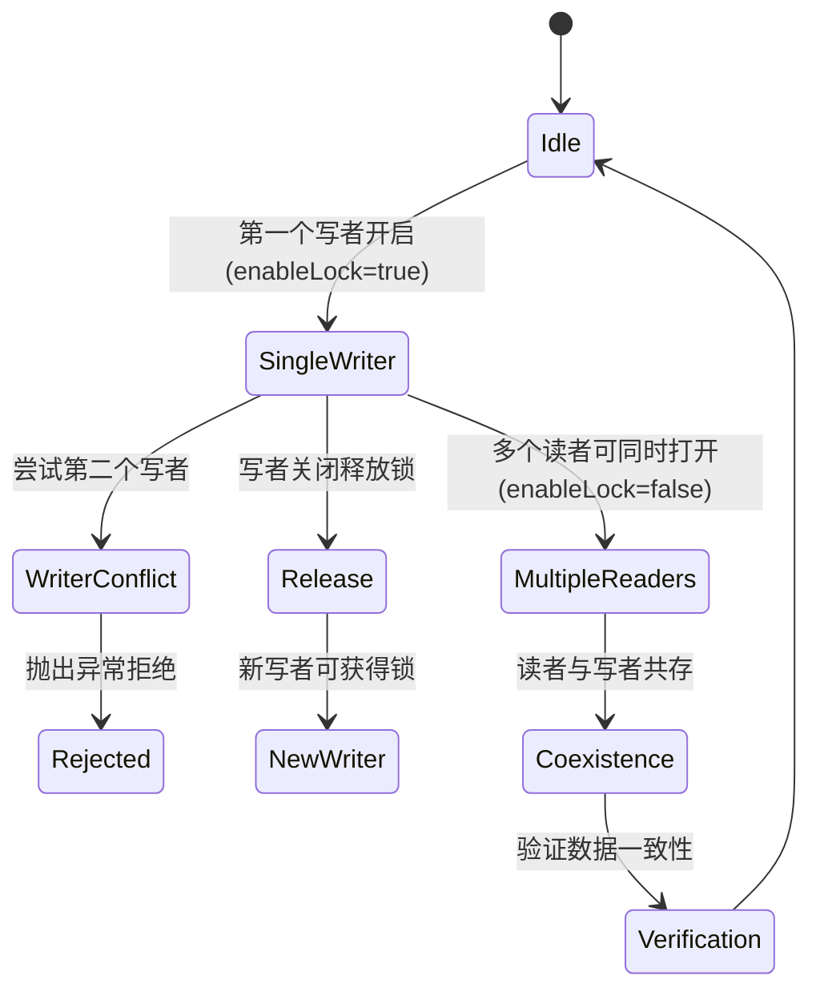
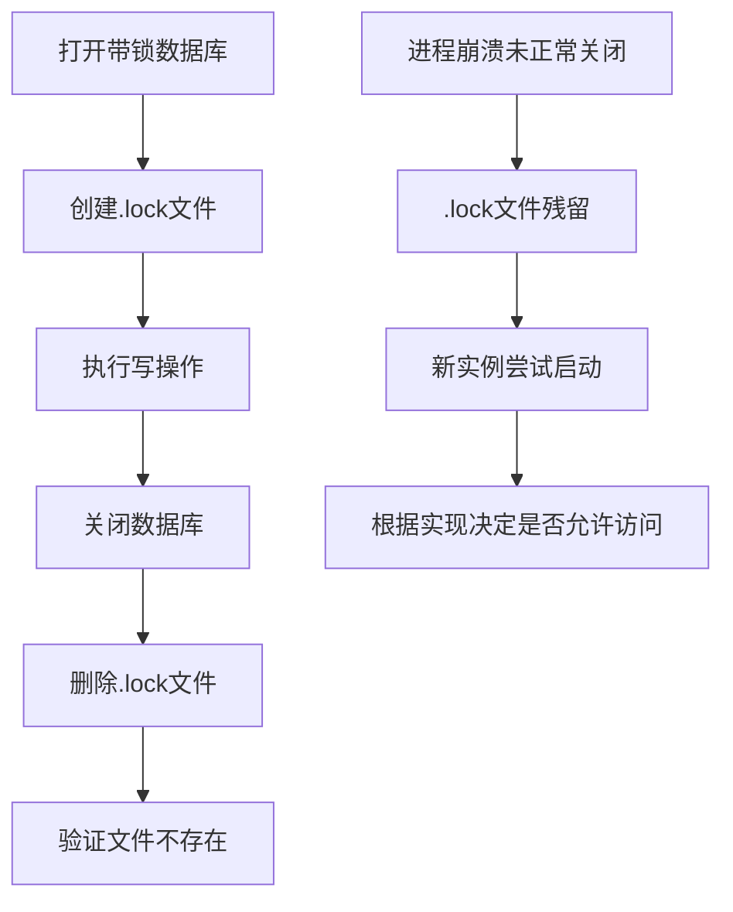

# 读者生命周期管理

<cite>
**本文档引用的文件**
- [readerRegistry.ts](file://src/storage/readerRegistry.ts)
- [concurrency_single_writer_guard.test.ts](file://tests/system/concurrency_single_writer_guard.test.ts)
- [wal.ts](file://src/storage/wal.ts)
- [gc_respect_readers.test.ts](file://tests/integration/maintenance/gc_respect_readers.test.ts)
- [auto_compact_respect_readers.test.ts](file://tests/integration/maintenance/auto_compact_respect_readers.test.ts)
- [wal_tail_truncation.test.ts](file://tests/integration/storage/wal_tail_truncation.test.ts)
</cite>

## 目录
1. [引言](#引言)
2. [核心组件分析](#核心组件分析)
3. [读者注册与注销机制](#读者注册与注销机制)
4. [GC与Compaction中的读事务保护](#gc与compaction中的读事务保护)
5. [WAL日志清理安全边界](#wal日志清理安全边界)
6. [并发场景下的资源保护验证](#并发场景下的资源保护验证)
7. [最佳实践建议](#最佳实践建议)

## 引言
本文档详细描述SynapseDB中ReaderRegistry如何跟踪活跃读事务的生命周期，包括读者注册、版本号分配与注销机制。重点解析其在垃圾回收（GC）和页面合并（Compaction）过程中如何阻止过期页面的回收，确保读快照的一致性。结合WAL的truncateTo操作，说明日志清理的安全边界计算逻辑，并通过测试用例验证多读一写场景下的资源保护能力。

## 核心组件分析

### ReaderRegistry设计原理
ReaderRegistry采用基于文件系统的实现方式，借鉴LSM-Tree分层思想，每个进程管理独立的reader文件，彻底避免多进程竞争单一文件的竞态条件。



**图示来源**
- [readerRegistry.ts](file://src/storage/readerRegistry.ts#L5-L208)

**本节来源**
- [readerRegistry.ts](file://src/storage/readerRegistry.ts#L5-L208)

## 读者注册与注销机制

### 读者注册流程
当新读事务开始时，系统通过`addReader`函数创建独立的reader文件，文件名格式为`{pid}-{timestamp}.reader`，内容包含进程ID、epoch和时间戳。



**图示来源**
- [readerRegistry.ts](file://src/storage/readerRegistry.ts#L55-L66)

### 读者注销流程
读事务结束时，通过`removeReader`函数删除对应进程的所有reader文件，实现优雅注销。



**图示来源**
- [readerRegistry.ts](file://src/storage/readerRegistry.ts#L72-L93)

### 活跃读者检测
`getActiveReaders`函数遍历readers目录，读取所有有效reader文件，同时自动清理超过30秒的过期文件。



**图示来源**
- [readerRegistry.ts](file://src/storage/readerRegistry.ts#L99-L140)

**本节来源**
- [readerRegistry.ts](file://src/storage/readerRegistry.ts#L55-L140)

## GC与Compaction中的读事务保护

### 垃圾回收保护机制
在执行垃圾回收前，系统检查是否存在活跃读者。如果存在，GC操作将被跳过，确保不会回收正在被读取的页面。



**图示来源**
- [gc_respect_readers.test.ts](file://tests/integration/maintenance/gc_respect_readers.test.ts#L50-L67)

### 自动合并保护机制
自动合并（Auto-Compact）同样尊重活跃读者，当检测到有读者存在时会返回skipped标志，避免影响正在进行的查询。



**图示来源**
- [auto_compact_respect_readers.test.ts](file://tests/integration/maintenance/auto_compact_respect_readers.test.ts#L50-L67)

### 版本号使用检测
`isEpochInUse`函数用于检查指定的epoch是否正在被任何读者使用，这是决定能否安全回收的关键判断。

```mermaid
sequenceDiagram
participant GC as "垃圾回收器"
participant Registry as "ReaderRegistry"
GC->>Registry : isEpochInUse(directory, targetEpoch)
Registry->>Registry : getActiveReaders(directory)
loop 每个活跃读者
Registry->>Registry : 检查reader.epoch === targetEpoch
alt 匹配成功
Registry-->>GC : 返回true
break
end
end
Registry-->>GC : 返回false
```

**图示来源**
- [readerRegistry.ts](file://src/storage/readerRegistry.ts#L165-L168)

**本节来源**
- [readerRegistry.ts](file://src/storage/readerRegistry.ts#L153-L168)
- [gc_respect_readers.test.ts](file://tests/integration/maintenance/gc_respect_readers.test.ts#L50-L67)
- [auto_compact_respect_readers.test.ts](file://tests/integration/maintenance/auto_compact_respect_readers.test.ts#L50-L67)

## WAL日志清理安全边界

### WAL重放安全偏移
WAL（Write-Ahead Log）在重放时计算safeOffset，确保只应用完整的记录批次，不完整或损坏的记录会被截断。

```mermaid
sequenceDiagram
participant Replayer as "WalReplayer"
participant File as "WAL文件"
Replayer->>File : 打开文件并读取头部
File-->>Replayer : 返回文件大小stat.size
loop 处理每条记录
Replayer->>File : 读取9字节固定头
File-->>Replayer : type, length, checksum
Replayer->>Replayer : 验证长度有效性
alt 长度无效
break
end
Replayer->>File : 读取payload
File-->>Replayer : payload数据
Replayer->>Replayer : 验证checksum
alt 校验失败
break
end
Replayer->>Replayer : 更新safeOffset = 当前偏移
Replayer->>Replayer : 处理记录内容
end
Replayer-->>系统 : 返回safeOffset作为安全截断点
```

**图示来源**
- [wal.ts](file://src/storage/wal.ts#L209-L246)

### 尾部截断安全测试
通过模拟WAL尾部不完整记录的场景，验证系统能够正确识别安全偏移并进行截断。



**图示来源**
- [wal_tail_truncation.test.ts](file://tests/integration/storage/wal_tail_truncation.test.ts#L59-L85)

**本节来源**
- [wal.ts](file://src/storage/wal.ts#L200-L299)
- [wal_tail_truncation.test.ts](file://tests/integration/storage/wal_tail_truncation.test.ts#L0-L85)

## 并发场景下的资源保护验证

### 单写者保护机制
通过`concurrency_single_writer_guard.test.ts`验证多读一写场景下的资源保护能力，确保写者互斥而读者可共享。



**图示来源**
- [concurrency_single_writer_guard.test.ts](file://tests/system/concurrency_single_writer_guard.test.ts#L0-L193)

### 锁文件生命周期
验证锁文件的创建与清理机制，确保正常关闭时锁文件被正确删除。



**图示来源**
- [concurrency_single_writer_guard.test.ts](file://tests/system/concurrency_single_writer_guard.test.ts#L150-L170)

**本节来源**
- [concurrency_single_writer_guard.test.ts](file://tests/system/concurrency_single_writer_guard.test.ts#L0-L193)

## 最佳实践建议

### 避免长时间持有读者句柄
为防止阻塞GC和Compaction操作，应遵循以下最佳实践：

1. **及时释放资源**：在查询完成后立即关闭快照或数据库连接
2. **设置超时机制**：对长时间运行的查询设置合理的超时限制
3. **批量处理**：将大查询分解为多个小批量操作
4. **监控活跃读者**：定期检查并清理异常的读者会话

```mermaid
flowchart LR
    A[开始查询] --> B[设置超时定时器]
    B --> C[执行