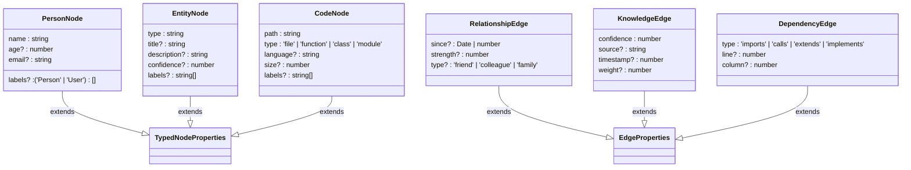

# 类型增强

<cite>
**本文档中引用的文件**
- [enhanced.ts](file://src/types/enhanced.ts)
- [typedSynapseDb.ts](file://src/typedSynapseDb.ts)
- [typed-synapsedb.test.ts](file://tests/types/typed-synapsedb.test.ts)
</cite>

## 目录
1. [简介](#简介)
2. [类型系统架构](#类型系统架构)
3. [核心类型工具详解](#核心类型工具详解)
4. [TypedSynapseDB 类实现分析](#typedsynapsedb-类实现分析)
5. [实际应用示例](#实际应用示例)
6. [API 兼容性与可维护性](#api-兼容性与可维护性)
7. [结论](#结论)

## 简介
SynapseDB 的增强类型系统通过 TypeScript 的高级类型特性，为图数据库操作提供了编译时类型安全。该系统在保持运行时兼容性的同时，显著提升了开发体验，实现了模式校验、属性推导和查询语句的类型安全。

**Section sources**
- [enhanced.ts](file://src/types/enhanced.ts#L1-L50)

## 类型系统架构
SynapseDB 的类型增强系统由两个核心文件构成：`enhanced.ts` 定义了泛型约束、条件类型和映射类型等类型工具，而 `typedSynapseDb.ts` 实现了类型安全的包装器类。这种分离设计使得类型定义与运行时逻辑解耦，便于维护和扩展。

**Diagram sources**
- [enhanced.ts](file://src/types/enhanced.ts#L1-L320)
- [typedSynapseDb.ts](file://src/typedSynapseDb.ts#L1-L292)

**Section sources**
- [enhanced.ts](file://src/types/enhanced.ts#L1-L320)
- [typedSynapseDb.ts](file://src/typedSynapseDb.ts#L1-L292)

## 核心类型工具详解
### 泛型约束与基础类型
增强类型系统定义了严格的泛型约束，确保类型安全。`NodeProperties` 和 `EdgeProperties` 接口作为所有节点和边属性的基础，被约束为 `Record<string, unknown>` 类型。

**Diagram sources**
- [enhanced.ts](file://src/types/enhanced.ts#L11-L28)

**Section sources**
- [enhanced.ts](file://src/types/enhanced.ts#L11-L28)

### 条件类型与映射类型
系统利用条件类型 `InferQueryResult` 和映射类型来实现查询结果的自动推导。`TypedPropertyFilter<T>` 接口使用泛型参数 T 来确保属性过滤器的类型一致性。

**Diagram sources**
- [enhanced.ts](file://src/types/enhanced.ts#L39-L58)
- [enhanced.ts](file://src/types/enhanced.ts#L127-L136)

**Section sources**
- [enhanced.ts](file://src/types/enhanced.ts#L39-L136)

### 预定义类型接口
为了简化常见用例，系统提供了多个预定义的类型接口，如社交网络、知识图谱和代码依赖等场景的专用类型。

**Diagram sources**
- [enhanced.ts](file://src/types/enhanced.ts#L240-L254)
- [enhanced.ts](file://src/types/enhanced.ts#L256-L264)

**Section sources**
- [enhanced.ts](file://src/types/enhanced.ts#L240-L275)

## TypedSynapseDB 类实现分析
### 查询构建器实现
`TypedQueryBuilderImpl` 类包装了原始的查询构建器，通过泛型参数传递类型信息，在运行时进行安全的类型转换。

**Diagram sources**
- [typedSynapseDb.ts](file://src/typedSynapseDb.ts#L114-L141)
- [enhanced.ts](file://src/types/enhanced.ts#L71-L122)

**Section sources**
- [typedSynapseDb.ts](file://src/typedSynapseDb.ts#L30-L141)

### 主数据库类实现
`TypedSynapseDBImpl` 类实现了 `TypedSynapseDB` 接口，通过委托模式将调用转发给底层的 `SynapseDB` 实例，并处理类型转换。

**Diagram sources**
- [typedSynapseDb.ts](file://src/typedSynapseDb.ts#L82-L215)
- [enhanced.ts](file://src/types/enhanced.ts#L141-L215)

**Section sources**
- [typedSynapseDb.ts](file://src/typedSynapseDb.ts#L82-L215)

## 实际应用示例
### 强类型 Fact Schema 定义
开发者可以定义强类型的 Fact Schema，获得完整的 IDE 智能提示和静态检查支持。

**Diagram sources**
- [enhanced.ts](file://src/types/enhanced.ts#L240-L254)
- [typed-synapsedb.test.ts](file://tests/types/typed-synapsedb.test.ts#L30-L60)

**Section sources**
- [typed-synapsedb.test.ts](file://tests/types/typed-synapsedb.test.ts#L30-L60)

### 类型安全查询流程
通过类型安全的查询流程，开发者可以在编译时捕获错误，避免运行时异常。

**Diagram sources**
- [typed-synapsedb.test.ts](file://tests/types/typed-synapsedb.test.ts#L62-L90)
- [typedSynapseDb.ts](file://src/typedSynapseDb.ts#L106-L112)

**Section sources**
- [typed-synapsedb.test.ts](file://tests/types/typed-synapsedb.test.ts#L62-L90)

## API 兼容性与可维护性
### 向后兼容性设计
增强类型系统采用包装器模式，确保与现有 API 完全兼容。原始的 `SynapseDB` 实例可以通过 `raw` 属性访问，允许渐进式迁移。

**Diagram sources**
- [typedSynapseDb.ts](file://src/typedSynapseDb.ts#L217-L235)
- [CHANGELOG.md](file://CHANGELOG.md#L60-L107)

**Section sources**
- [typedSynapseDb.ts](file://src/typedSynapseDb.ts#L217-L235)

### 大型项目可维护性优势
在大型项目中，增强类型系统提供了显著的可维护性优势，包括更好的代码文档化、重构安全性和团队协作效率。

**Diagram sources**
- [CHANGELOG.md](file://CHANGELOG.md#L60-L107)
- [README.md](file://README.md#L317-L344)

**Section sources**
- [CHANGELOG.md](file://CHANGELOG.md#L60-L107)

## 结论
SynapseDB 的增强类型系统通过精心设计的泛型约束、条件类型和映射类型，为开发者提供了卓越的 TypeScript 开发体验。`TypedSynapseDB` 类充分利用这些类型工具，实现了编译时模式校验、属性自动推导和查询语句的类型安全。该系统不仅保持了向后兼容性，还在大型项目中展现了出色的可维护性优势，是现代图数据库类型安全实践的典范。