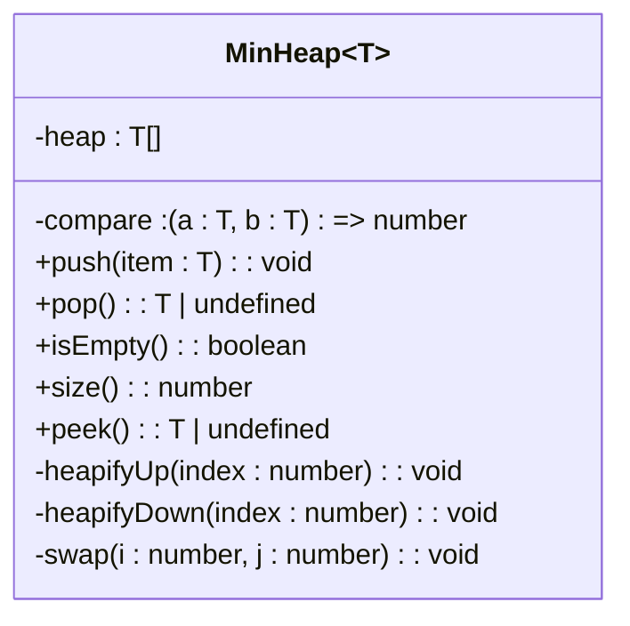
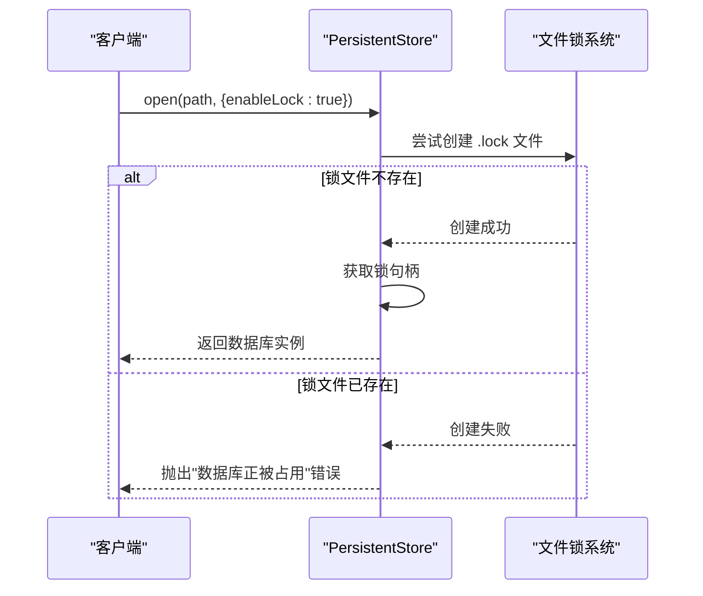
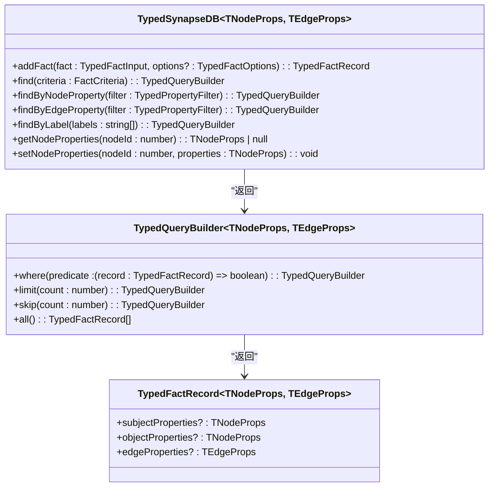

# 高级主题

<cite>
**本文档中引用的文件**
- [suite.ts](file://src/algorithms/suite.ts)
- [minHeap.ts](file://src/utils/minHeap.ts)
- [lock.ts](file://src/utils/lock.ts)
- [enhanced.ts](file://src/types/enhanced.ts)
- [persistentStore.ts](file://src/storage/persistentStore.ts)
</cite>

## 目录
1. [图算法模块高级分析能力](#图算法模块高级分析能力)
2. [路径规划中的最小堆优先级调度机制](#路径规划中的最小堆优先级调度机制)
3. [高并发环境下的读写锁同步策略](#高并发环境下的读写锁同步策略)
4. [增强类型系统支持精确类型推断](#增强类型系统支持精确类型推断)
5. [组件调用与自定义插件扩展](#组件调用与自定义插件扩展)
6. [性能敏感场景最佳实践](#性能敏感场景最佳实践)

## 图算法模块高级分析能力

`algorithms` 模块提供了完整的图分析能力，通过 `GraphAlgorithmSuiteImpl` 类统一暴露各类高级算法接口。该套件实现了 `GraphAlgorithmSuite` 接口，包含中心性计算、社区发现、相似度度量和图结构分析四大功能域。

在中心性计算方面，系统实现了 PageRank、中介中心性（Betweenness）、接近中心性（Closeness）、度中心性和特征向量中心性等多种算法。这些算法通过工厂模式 `CentralityAlgorithmFactory` 创建实例，采用统一的 `compute` 方法执行计算，返回标准化的 `CentralityResult` 结构。

社区发现功能支持 Louvain 算法、标签传播（Label Propagation）以及连通分量检测。其中 Louvain 算法可用于大规模网络的层次化社区划分，而强连通分量检测则基于深度优先搜索实现，适用于有向图的环路分析。

相似度度量提供 Jaccard 相似度、余弦相似度、Adamic-Adar 和优先连接等指标，用于评估节点间的关联强度。这些算法均通过 `SimilarityAlgorithmFactory` 工厂创建，并由 `CompositeSimilarityAlgorithm` 支持多算法加权组合。

图分析组件还包含桥边检测、关节点识别、环路检测和拓扑排序等图论基础算法，为复杂网络分析提供底层支持。

**Section sources**
- [suite.ts](file://src/algorithms/suite.ts#L61-L406)
- [types.ts](file://src/algorithms/types.ts#L274-L316)
- [centrality.ts](file://src/algorithms/centrality.ts#L593-L650)
- [similarity.ts](file://src/algorithms/similarity.ts#L618-L691)

## 路径规划中的最小堆优先级调度机制

路径规划算法依赖 `MinHeap` 数据结构实现高效的优先级调度。该最小堆类位于 `utils/minHeap.ts`，采用数组存储二叉堆结构，通过比较函数 `compare` 支持泛型元素的自定义排序。

在 Dijkstra 最短路径算法中，`MinHeap` 作为优先队列使用，确保每次都能以 O(log n) 时间复杂度取出当前距离最短的节点。其核心操作包括：
- `push(item)`：插入元素并向上堆化，维持堆属性
- `pop()`：弹出堆顶元素并向下堆化，时间复杂度 O(log n)
- `peek()`：查看最小元素而不移除

堆化过程通过 `heapifyUp` 和 `heapifyDown` 方法实现，利用父子节点索引关系（父节点 i 的子节点为 2i+1 和 2i+2）进行位置调整。这种设计相比线性搜索的 O(n) 性能有显著提升，是高效路径查找的关键优化。

值得注意的是，在 `centrality.ts` 文件中存在一个同名但独立实现的 `MinHeap` 类，专用于特定中心性算法的内部计算，体现了针对不同场景的定制化优化思路。

**Diagram sources**
- [minHeap.ts](file://src/utils/minHeap.ts#L4-L113)

**Section sources**
- [minHeap.ts](file://src/utils/minHeap.ts#L4-L113)
- [pathfinding.ts](file://src/algorithms/pathfinding.ts)

## 高并发环境下的读写锁同步策略

系统通过 `acquireLock` 函数实现进程级独占写锁，防止多个写入者同时访问同一数据库文件。该机制位于 `utils/lock.ts`，采用文件锁方式实现跨进程同步。

当启用锁机制时（`enableLock=true`），系统会在数据库路径后缀添加 `.lock` 文件。通过 `fs.open(lockPath, 'wx')` 原子操作尝试创建该文件，若已存在则抛出异常，从而保证同一时刻只有一个写入者。

锁文件中记录了持有者的进程 ID 和启动时间，便于故障排查。系统注册了 `exit`、`SIGINT` 和 `SIGTERM` 信号处理器，在进程退出时自动释放锁资源，避免死锁问题。

在 `PersistentStore` 中，锁机制与 WAL（Write-Ahead Logging）协同工作。当存在写锁且 WAL 文件非空时，禁止无锁模式打开，防止并发写入风险。这种双重保护机制确保了数据一致性和完整性。

**Diagram sources**
- [lock.ts](file://src/utils/lock.ts#L6-L41)
- [persistentStore.ts](file://src/storage/persistentStore.ts#L99-L238)

**Section sources**
- [lock.ts](file://src/utils/lock.ts#L6-L41)
- [persistentStore.ts](file://src/storage/persistentStore.ts#L54-L54)

## 增强类型系统支持精确类型推断

`enhanced.ts` 文件定义了泛型化的类型系统，为 SynapseDB 提供强类型的 API 支持。核心接口 `TypedSynapseDB` 使用泛型参数约束节点属性 `TNodeProps` 和边属性 `TEdgeProps`，实现编译时类型安全。

该系统支持：
- 类型安全的 Fact 操作：`addFact` 返回带有正确属性类型的 `TypedFactRecord`
- 泛型化查询构建器：`TypedQueryBuilder` 维护查询上下文的类型信息
- 属性过滤器类型：`TypedPropertyFilter` 支持基于具体值类型的条件筛选
- 标签查询：`findByLabel` 方法支持 AND/OR 逻辑模式

通过 `open` 工厂方法，用户可以指定自定义的节点和边属性接口，如社交网络中的 `PersonNode` 和 `RelationshipEdge`，或知识图谱中的 `EntityNode` 和 `KnowledgeEdge`。这种设计既保持了灵活性，又提供了严格的类型检查。

**Diagram sources**
- [enhanced.ts](file://src/types/enhanced.ts#L141-L215)

**Section sources**
- [enhanced.ts](file://src/types/enhanced.ts#L141-L215)

## 组件调用与自定义插件扩展

各算法组件通过工厂模式组织，支持灵活的实例化和扩展。`GraphAlgorithmFactoryImpl` 提供 `createAlgorithmSuite(graph)` 方法，为指定图实例创建完整的算法套件。

上层功能通过 `createAlgorithmSuite` 函数获取算法接口，无需关心具体实现细节。这种依赖注入模式降低了耦合度，便于单元测试和功能替换。

对于自定义算法插件，系统可通过扩展工厂类或直接实现相应算法接口进行集成。例如，可创建新的 `SimilarityAlgorithm` 实现并注册到 `SimilarityAlgorithmFactory` 中，然后通过 `createComposite` 方法与其他算法组合使用。

基准测试模块 `benchmark/suites.ts` 展示了算法套件的实际调用方式，通过构造内存图 `MemoryGraph` 并注入测试数据来验证算法性能。

**Section sources**
- [suite.ts](file://src/algorithms/suite.ts#L536-L536)
- [index.ts](file://src/algorithms/index.ts#L65-L65)
- [suites.ts](file://src/benchmark/suites.ts#L389-L574)

## 性能敏感场景最佳实践

在性能关键场景下，应遵循以下最佳实践：

1. **避免长时间持有写锁**：写操作完成后应及时调用 `flush()` 并尽快释放资源，减少对其他进程的影响。建议将大事务拆分为多个小批量操作。

2. **合理设置算法超时阈值**：复杂算法如 PageRank 和 Louvain 应配置 `maxIterations` 和 `tolerance` 参数，防止无限迭代。可通过 `AlgorithmOptions` 接口传入这些控制参数。

3. **优化路径查找性能**：对于频繁的最短路径查询，考虑预计算或缓存结果。A* 算法可通过提供有效的启发式函数 `heuristic` 显著提升搜索效率。

4. **控制图规模**：大型图分析可能消耗大量内存，建议使用子图 `getSubgraph` 方法限定分析范围，或采用流式处理方式。

5. **监控资源使用**：利用 `getStats()` 获取图统计信息，监控节点数、边数和平均度数等指标，及时发现异常增长。

这些实践有助于在保证功能完整性的同时，维持系统的高性能和稳定性。

**Section sources**
- [suite.ts](file://src/algorithms/suite.ts#L61-L406)
- [types.ts](file://src/algorithms/types.ts#L187-L198)
- [persistentStore.ts](file://src/storage/persistentStore.ts#L76-L76)