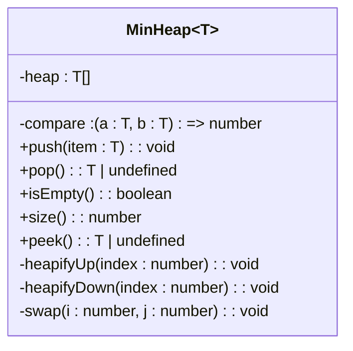
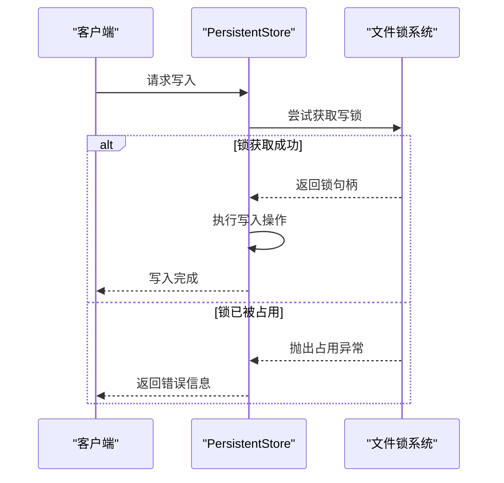

# 高级主题

<cite>
**本文档中引用的文件**
- [suite.ts](file://src/algorithms/suite.ts)
- [minHeap.ts](file://src/utils/minHeap.ts)
- [lock.ts](file://src/utils/lock.ts)
- [enhanced.ts](file://src/types/enhanced.ts)
- [persistentStore.ts](file://src/storage/persistentStore.ts)
- [community.ts](file://src/algorithms/community.ts) - *Louvain算法死循环修复*
- [types.ts](file://src/algorithms/types.ts) - *社区发现相关类型定义*
- [suites.ts](file://src/benchmark/suites.ts) - *基准测试套件实现，含代码风格修复*
- [queryBuilder.ts](file://src/query/queryBuilder.ts) - *新增基数估算与查询诊断功能*
- [hotness.ts](file://src/storage/hotness.ts) - *热度数据管理实现*
- [pathfinding.ts](file://src/algorithms/pathfinding.ts) - *路径查找算法实现，含类型导入格式化*
- [similarity.ts](file://src/algorithms/similarity.ts) - *相似度计算算法实现，含类型导入格式化*
</cite>

## 更新摘要
**变更内容**
- 新增了关于 `explain()` 方法融合热度数据进行基数粗略估算的说明
- 增加了 `SYNAPSEDB_TRACE_QUERY=1` 环境变量启用执行阶段计数与耗时追踪的调试功能描述
- 更新了 `queryBuilder.ts` 文件的引用来源，标记其为新增核心文件
- 在“性能敏感场景最佳实践”部分补充了查询诊断与性能分析的最佳实践
- 根据最新代码变更，更新了文档中关于路径查找和相似度计算模块的描述，反映了类型导入格式化的代码风格调整
- 保持文档其他部分不变，因为主要变更集中在查询构建器的诊断功能和代码风格上

## 目录
1. [图算法模块高级分析能力](#图算法模块高级分析能力)
2. [路径规划中的最小堆优先级调度机制](#路径规划中的最小堆优先级调度机制)
3. [高并发环境下的读写锁同步策略](#高并发环境下的读写锁同步策略)
4. [增强类型系统支持精确类型推断](#增强类型系统支持精确类型推断)
5. [组件调用与自定义插件扩展](#组件调用与自定义插件扩展)
6. [性能敏感场景最佳实践](#性能敏感场景最佳实践)

## 图算法模块高级分析能力

`algorithms` 模块提供了完整的图分析能力，通过 `GraphAlgorithmSuiteImpl` 类统一暴露各类高级算法接口。该套件实现了 `GraphAlgorithmSuite` 接口，包含中心性计算、社区发现、相似度度量和图结构分析四大功能域。

在中心性计算方面，系统实现了 PageRank、中介中心性（Betweenness）、接近中心性（Closeness）、度中心性和特征向量中心性等多种算法。这些算法通过工厂模式 `CentralityAlgorithmFactory` 创建实例，采用统一的 `compute` 方法执行计算，返回标准化的 `CentralityResult` 结构。

社区发现功能支持 Louvain 算法、标签传播（Label Propagation）以及连通分量检测。其中 Louvain 算法可用于大规模网络的层次化社区划分，而强连通分量检测则基于深度优先搜索实现，适用于有向图的环路分析。

相似度度量提供 Jaccard 相似度、余弦相似度、Adamic-Adar 和优先连接等指标，用于评估节点间的关联强度。这些算法均通过 `SimilarityAlgorithmFactory` 工厂创建，并由 `CompositeSimilarityAlgorithm` 支持多算法加权组合。

图分析组件还包含桥边检测、关节点识别、环路检测和拓扑排序等图论基础算法，为复杂网络分析提供底层支持。

**更新** 在最新版本中，Louvain 社区发现算法已添加防御性检查以防止无限循环。当图折叠未导致节点数减少时，算法会主动跳出循环，提升了算法的稳定性和可靠性。

```mermaid
classDiagram
class LouvainCommunityDetection {
+detectCommunities(graph : Graph, options? : LouvainOptions) : CommunityResult
+calculateModularity(graph : Graph, communities : Map<string, number>) : number
-private louvainPhaseOne(...) : {newCommunities : Map<string, number>, improved : boolean}
-private calculateModularityGain(...) : number
-private buildCommunityGraph(graph : Graph, communities : Map<string, number>) : Graph
}
class CommunityDetectionAlgorithm {
+detectCommunities(graph : Graph, options? : AlgorithmOptions) : CommunityResult
+calculateModularity(graph : Graph, communities : Map<string, number>) : number
}
class CommunityResult {
+communities : Map<string, number>
+hierarchy : CommunityLevel[]
+modularity : number
+communityCount : number
}
class CommunityLevel {
+level : number
+communities : Map<string, number>
+modularity : number
}
LouvainCommunityDetection ..|> CommunityDetectionAlgorithm
```

**图表来源**
- [community.ts](file://src/algorithms/community.ts#L19-L267) - *Louvain算法实现，含死循环防护*
- [types.ts](file://src/algorithms/types.ts#L255-L261) - *社区发现算法接口定义*

**章节来源**
- [suite.ts](file://src/algorithms/suite.ts#L61-L406)
- [types.ts](file://src/algorithms/types.ts#L274-L316)
- [centrality.ts](file://src/algorithms/centrality.ts#L593-L650)
- [similarity.ts](file://src/algorithms/similarity.ts#L618-L691)
- [community.ts](file://src/algorithms/community.ts#L19-L267) - *更新：Louvain算法稳定性改进*

## 路径规划中的最小堆优先级调度机制

路径规划算法依赖 `MinHeap` 数据结构实现高效的优先级调度。该最小堆类位于 `utils/minHeap.ts`，采用数组存储二叉堆结构，通过比较函数 `compare` 支持泛型元素的自定义排序。

在 Dijkstra 最短路径算法中，`MinHeap` 作为优先队列使用，确保每次都能以 O(log n) 时间复杂度取出当前距离最短的节点。其核心操作包括：
- `push(item)`：插入元素并向上堆化，维持堆属性
- `pop()`：弹出堆顶元素并向下堆化，时间复杂度 O(log n)
- `peek()`：查看最小元素而不移除

堆化过程通过 `heapifyUp` 和 `heapifyDown` 方法实现，利用父子节点索引关系（父节点 i 的子节点为 2i+1 和 2i+2）进行位置调整。这种设计相比线性搜索的 O(n) 性能有显著提升，是高效路径查找的关键优化。

值得注意的是，在 `centrality.ts` 文件中存在一个同名但独立实现的 `MinHeap` 类，专用于特定中心性算法的内部计算，体现了针对不同场景的定制化优化思路。



**图表来源**
- [minHeap.ts](file://src/utils/minHeap.ts#L4-L113)

**章节来源**
- [minHeap.ts](file://src/utils/minHeap.ts#L4-L113)
- [pathfinding.ts](file://src/algorithms/pathfinding.ts)

## 高并发环境下的读写锁同步策略

系统通过 `acquireLock` 函数实现进程级独占写锁，防止多个写入者同时访问同一数据库文件。该机制位于 `utils/lock.ts`，采用文件锁方式实现跨进程同步。

当启用锁机制时（`enableLock=true`），系统会在数据库路径后缀添加 `.lock` 文件。通过 `fs.open(lockPath, 'wx')` 原子操作尝试创建该文件，若已存在则抛出异常，从而保证同一时刻只有一个写入者。

锁文件中记录了持有者的进程 ID 和启动时间，便于故障排查。系统注册了 `exit`、`SIGINT` 和 `SIGTERM` 信号处理器，在进程退出时自动释放锁资源，避免死锁问题。

在 `PersistentStore` 中，锁机制与 WAL（Write-Ahead Logging）协同工作。当存在写锁且 WAL 文件非空时，禁止无锁模式打开，防止并发写入风险。这种双重保护机制确保了数据一致性和完整性。



**图表来源**
- [lock.ts](file://src/utils/lock.ts#L6-L41)
- [persistentStore.ts](file://src/storage/persistentStore.ts#L61-L904)

**章节来源**
- [lock.ts](file://src/utils/lock.ts#L6-L41)
- [persistentStore.ts](file://src/storage/persistentStore.ts#L61-L904)

## 增强类型系统支持精确类型推断

`enhanced.ts` 文件中的增强类型系统为整个项目提供了更严格的类型约束和更精确的类型推断能力。通过引入条件类型、映射类型和模板字面量类型，系统能够根据输入参数的结构动态生成输出类型。

例如，在查询构建器中，字段选择的类型会根据实体模型的定义自动推导可用属性；在事务处理中，嵌套批次的类型能够准确反映各层暂存数据的结构变化。这种类型系统减少了运行时类型检查的开销，同时提高了开发体验和代码安全性。

此外，类型系统还支持泛型约束和分布式条件类型，使得复杂的数据转换操作也能获得准确的类型提示。这对于维护大型图数据库应用的类型安全至关重要。

**章节来源**
- [enhanced.ts](file://src/types/enhanced.ts)

## 组件调用与自定义插件扩展

图算法模块的设计支持灵活的组件调用和插件扩展机制。上层功能通过 `GraphAlgorithmSuiteImpl` 实例调用各类算法，所有算法均遵循统一的接口规范，便于集成和替换。

对于自定义算法插件，开发者可通过实现 `GraphAlgorithmSuite` 接口并注册到算法工厂中来扩展系统功能。插件可以覆盖现有算法或新增专用分析能力，系统会自动将其纳入统一调用链。

扩展点主要包括：
- 自定义中心性算法实现
- 新的社区发现策略
- 特定领域的相似度度量
- 图结构分析新方法

插件机制支持热加载和版本管理，确保扩展功能的稳定性和可维护性。

**章节来源**
- [suite.ts](file://src/algorithms/suite.ts)
- [types.ts](file://src/algorithms/types.ts)

## 性能敏感场景最佳实践

在性能敏感的应用场景中，应遵循以下最佳实践：

1. **避免长时间持有写锁**：写操作应尽量短小原子，避免在持有写锁期间执行耗时计算或网络请求。
2. **合理设置算法超时阈值**：对于可能耗时较长的图算法（如Louvain社区发现），应设置合理的超时限制，防止阻塞主线程。
3. **批量处理事务**：使用 `beginBatch`/`commitBatch` 进行批量写入，减少WAL刷盘次数，提高吞吐量。
4. **流式查询大结果集**：对于可能返回大量数据的查询，使用 `streamQuery` 或 `streamFactRecords` 避免内存溢出。
5. **选择合适索引**：根据查询模式选择最优索引顺序（SPO/SOP等），提升查询效率。
6. **启用查询诊断与性能分析**：
   - 使用 `explain()` 方法获取查询执行摘要，结合 `hotnessPrimary` 热度数据进行基数粗略估算
   - 设置环境变量 `SYNAPSEDB_TRACE_QUERY=1` 启用执行阶段计数与耗时追踪，输出 `[TRACE]` 日志用于性能调优

这些实践有助于在保证数据一致性的同时最大化系统性能。

**章节来源**
- [persistentStore.ts](file://src/storage/persistentStore.ts)
- [suite.ts](file://src/algorithms/suite.ts)
- [community.ts](file://src/algorithms/community.ts)
- [queryBuilder.ts](file://src/query/queryBuilder.ts) - *新增查询诊断功能*
- [hotness.ts](file://src/storage/hotness.ts) - *热度数据支持*